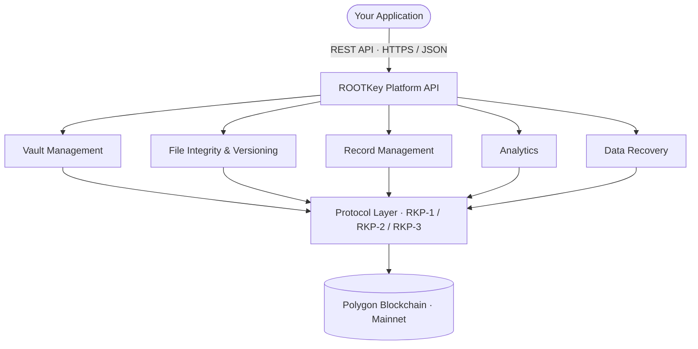

The ROOTKey API is a REST API that gives you programmatic access to vault management, file integrity anchoring, validation, and analytics. All communication happens over HTTPS with JSON request and response bodies. Every write operation is anchored to the Polygon blockchain according to the configured [data processing protocol](/pages/protocols/overview).

---

## Architecture



The blockchain anchor is written synchronously (RKP-1) or asynchronously (RKP-2, RKP-3) depending on your vault configuration.

---

## Core Resources

<CardGroup cols={2}>
  <Card title="Vaults" icon="vault" href="/api-reference/platform/endpoint/vaults/create-vault">
    Vaults are the top-level containers for your data assets. Each vault has its own protocol configuration, access controls, and lifecycle management.
  </Card>
  <Card title="Files" icon="file" href="/api-reference/platform/endpoint/files/get-files">
    Files are the primary asset type within a vault. Each file supports versioning, validation, history traversal, and ownership transfer - all with integrity anchoring.
  </Card>
  <Card title="Records" icon="rows" href="/api-reference/platform/endpoint/records/overview">
    Individual records within a table, with full version history and per-record integrity validation.
  </Card>
  <Card title="Data Recovery" icon="rotate-left" href="/api-reference/platform/endpoint/recovery/list-recoverable-items">
    Restore soft-deleted vaults and files within the recovery window. Blockchain anchors are unaffected — on-chain proofs remain valid regardless of deletion state.
  </Card>
</CardGroup>

---

## Key Capabilities

| Capability | Description |
|------------|-------------|
| **Integrity anchoring** | Every write operation produces a cryptographic proof anchored to the Polygon blockchain |
| **Version history** | Full lineage tracking for files and records - every version is independently verifiable |
| **Validation** | On-demand integrity validation against the on-chain proof - detect tampering at any point in the asset lifecycle |
| **Ownership transfer** | Transfer custody of assets between vaults or accounts with an immutable chain-of-custody record |
| **Analytics** | Usage and activity metrics for monitoring workloads, adoption, and operational patterns |
| **Data Recovery** | Restore soft-deleted vaults and files within the retention window before permanent deletion |

---

## Base URLs

| Environment | Base URL |
|-------------|----------|
| **Development** | `https://dev-api.rootkey.ai` |
| **Production** | `https://api.rootkey.ai` |

All endpoints are relative to the base URL for the target environment. See [Environments](/pages/environments) for details on switching between them.

---

## Authentication

Every request must include your API key in the `x-api-key` header:

```shell
x-api-key: your_api_key_here
```

API keys are scoped to an environment (sandbox or live) and a workspace. Generate and manage your keys from the ROOTKey platform dashboard. See [API Keys](/pages/api-keys) for step-by-step instructions.

<Warning>
  Never expose API keys in client-side code, public repositories, or logs. Rotate keys immediately if you suspect a compromise.
</Warning>

---

## Protocol Configuration

Each vault is configured with a data processing protocol that determines how writes are anchored:

| Protocol | Anchoring | Throughput | Use for |
|----------|-----------|------------|---------|
| [RKP-1](/pages/protocols/rkp-1-on-chain) | Full on-chain | Lower | Regulatory-critical, legal, financial |
| [RKP-2](/pages/protocols/rkp-2-off-chain) | Off-chain + proof | Higher | IoT, high-volume, real-time |
| [RKP-3](/pages/protocols/rkp-3-hybrid) | Hybrid | Balanced | Enterprise document management |

---

## Request Format

All request bodies must be sent as JSON with the `Content-Type: application/json` header.

```shell
Content-Type: application/json
```

---

## Response Format

Responses are JSON objects. Successful responses return a `2xx` status code. Errors return a structured object with a machine-readable code and a human-readable message. See [Error Reference](/api-reference/errors) for the full error schema.

---

## Rate Limits

API requests are rate-limited per API key based on your active plan. Exceeded limits return `429 Too Many Requests`. See [Rate Limits](/pages/rate-limits) for plan-specific limits and retry guidance.

---

## Versioning

The API is versioned. Breaking changes are introduced only in new major versions with advance notice. See [API Versioning](/pages/api-versioning) for the full versioning policy and deprecation timelines.

---

## Support

If you encounter issues or have questions about the API, contact our team at [support@rootkey.ai](mailto:support@rootkey.ai) or visit the [Support](/pages/support) page.
