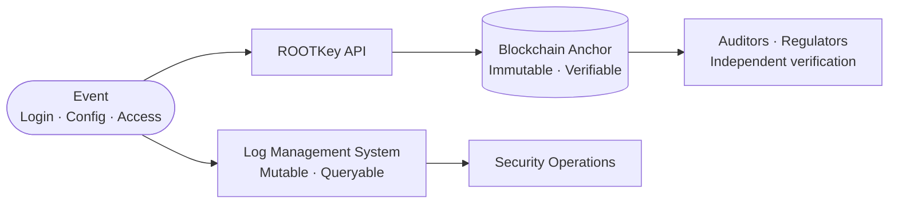

## Overview

**ISO/IEC 27001:2022** is the international standard for Information Security Management Systems (ISMS). Certification requires organisations to implement and maintain a set of controls - and to demonstrate, through audits, that those controls are operating effectively.

The critical word is *demonstrate*: ISO 27001 auditors look for evidence that controls were applied, that logs were protected from tampering, and that records accurately reflect what happened in the system under assessment. Where audit evidence can be altered by administrators, auditors must rely on organisational assurance.

ROOTKey removes that dependency by making key ISMS records tamper-evident and independently verifiable.

<Note>
  ROOTKey's ISO 27001 certification is currently in progress. This page reflects how ROOTKey's capabilities address ISO 27001 control requirements for customers pursuing or maintaining certification.
</Note>

---

## Annex A Control Mapping

### A.5 - Organisational Controls

| Control | Requirement | ROOTKey capability |
|---------|-------------|-------------------|
| **A.5.33** | Protection of records | Anchor records at creation - no administrator can alter them after anchoring regardless of system access |
| **A.5.36** | Compliance with policies, rules, and standards | Anchor policy versions - tamper-evident proof that a specific policy was in force at a specific time |
| **A.5.37** | Documented operating procedures | Anchor procedure documents at approval and each revision - verifiable version history |

### A.8 - Technological Controls

| Control | Requirement | ROOTKey capability |
|---------|-------------|-------------------|
| **A.8.9** | Configuration management | Anchor configuration baselines and change records - tamper-evident configuration history |
| **A.8.15** | Logging | Anchor audit logs at emission - before they reach any mutable storage - making them tamper-evident |
| **A.8.16** | Monitoring activities | Anchor monitoring event records and anomaly detections at time of occurrence |
| **A.8.20** | Network security | Anchor network configuration and access control records |
| **A.8.32** | Change management | Anchor change approval records, test results, and post-deployment verification |

---

## Log Protection - The Core Use Case

ISO 27001 A.8.15 requires audit logs that capture user activities, exceptions, and security events. The standard also requires that logs be protected from tampering. This is where most ISMS implementations have a structural weakness:

- Logs are stored in systems that administrators can access
- When an incident is under investigation, the organisation producing the logs is often the subject of the investigation
- Auditors must trust the organisation's assurance that logs were not modified

ROOTKey anchors each log entry at emission - before it reaches the log management system. This creates an independent integrity proof that is verifiable regardless of what happens to the log storage.

The log management system retains logs for operational queries. The blockchain anchor retains the integrity proof for audit purposes. The two are independent.

---

## Configuration Management Records

A.8.9 requires organisations to maintain configuration management processes covering security-relevant configurations of hardware, software, services, and networks. ROOTKey anchors:

- Configuration baselines at approval
- Each configuration change record (who changed what, when, and the approved change request reference)
- Post-change verification records

The result is a cryptographically verifiable configuration history that auditors can examine independently.

---

## ISMS Statement of Applicability and Risk Treatment

ISO 27001 requires a Statement of Applicability (SoA) and Risk Treatment Plan that document which controls are applied and why. These documents are themselves subject to version control requirements. ROOTKey anchors:

- The SoA at each review and approval
- Risk assessment records at each assessment cycle
- Internal audit records and management review outputs

---

## Evidence for External Audits

ISO 27001 certification audits (Stage 1 and Stage 2) and surveillance audits require auditors to examine evidence of control operation. ROOTKey supports audit evidence production by:

| Audit requirement | ROOTKey evidence |
|-------------------|-----------------|
| Log integrity | Blockchain-anchored log records, independently verifiable by auditor on Polygonscan |
| Change management evidence | Anchored change records with timestamps the organisation cannot alter |
| Configuration baseline verification | Anchored configuration history per system |
| Policy and procedure currency | Anchored policy versions - auditor can verify which version was active at any date |
| Access control event records | Anchored access grant/revocation events |

---

<CardGroup cols={2}>
  <Card
    title="Request an ISO 27001 architecture review"
    icon="calendar"
    href="https://rootkey.ai/contact?utm_source=api_docs&utm_medium=compliance_iso27001&utm_content=demo_cta"
  >
    We'll map the controls in your ISMS scope to ROOTKey capabilities and design an evidence architecture that satisfies your certification body.
  </Card>
  <Card
    title="Regulatory audit trails use case"
    icon="scale-balanced"
    href="/use-cases/regulatory-audit-trails"
  >
    Full implementation guide for ISO 27001-aligned tamper-evident logging.
  </Card>
</CardGroup>
