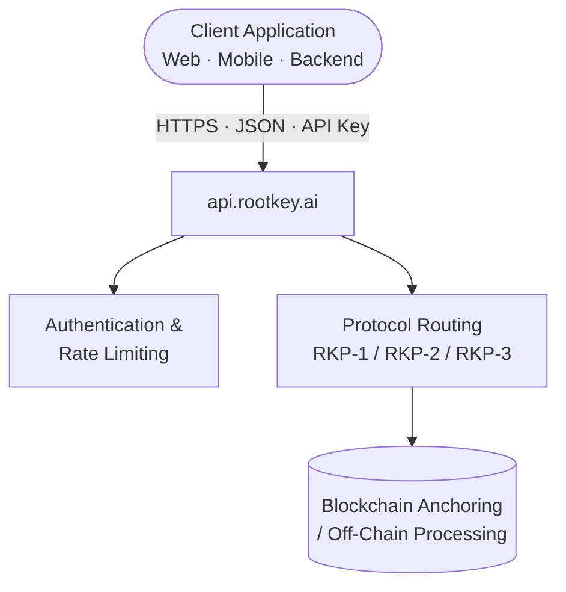

## Overview

The ROOTKey REST API is the default integration model and the fastest path from zero to production. It exposes a JSON API over HTTPS with API key authentication and consistent error schemas, available across dedicated development and production endpoints.

No infrastructure setup is required on the client side. Authentication, protocol routing, and blockchain anchoring are handled by ROOTKey's cloud infrastructure.

This model is appropriate for any team building web-native, cloud-native, or service-oriented architectures - and for organisations that want to validate ROOTKey capabilities quickly before committing to a more embedded deployment.

---

## Architecture Overview

All API calls are authenticated using an `x-api-key` header. Development and production use separate base URLs and separate API keys. See [Environments](/pages/environments) for details.

---

## Integration Characteristics

| Property | Value |
|----------|-------|
| Protocol | REST over HTTPS (TLS 1.2+) |
| Data format | JSON |
| Authentication | API Key (`x-api-key` header) |
| Development URL | `https://dev-api.rootkey.ai` |
| Production URL | `https://api.rootkey.ai` |
| Versioning | Header-based |

---

## Typical Use Cases

<CardGroup cols={2}>
  <Card title="SaaS Platform Integration" icon="cloud">
    Embed ROOTKey data integrity capabilities directly into a SaaS product - attach proof-of-existence to user-generated content, contracts, or records at creation time.
  </Card>
  <Card title="Backend Microservices" icon="circle-nodes">
    Add tamper-evident logging or validation to individual services within a distributed architecture without additional infrastructure.
  </Card>
  <Card title="Web Application Backends" icon="globe">
    Validate and anchor documents, forms, or records submitted through web applications - with an audit trail that outlasts the application itself.
  </Card>
  <Card title="Automated Compliance Workflows" icon="shield-check">
    Integrate ROOTKey into CI/CD pipelines, data processing jobs, or scheduled compliance tasks - anchoring artefacts at every stage.
  </Card>
</CardGroup>

---

## Integration Considerations

**Authentication and key management**
API keys should be stored as environment secrets and rotated regularly. Development and production keys are distinct and tied to their respective base URLs - never use a development key against the production endpoint, or vice versa.

**Rate limiting**
API calls are subject to rate limits determined by the active subscription plan. Exceeding limits results in `429 Too Many Requests` responses. See [Pricing](/pages/pricing) for plan-specific limits.

**Error handling**
The API returns structured error responses with machine-readable codes. Implement retry logic with exponential backoff for transient failures (`5xx`). See [Error Reference](/api-reference/errors) for the full error schema.

**Idempotency**
Operations that anchor data to the blockchain are not inherently idempotent - duplicate submissions result in separate on-chain records. Client-side deduplication should be implemented where appropriate.

**Webhook support**
Asynchronous operations (e.g. blockchain anchoring in RKP-2 and RKP-3) emit webhook events when complete. Configure webhook endpoints in the ROOTKey dashboard to receive real-time status notifications.

---

## Getting Started

<Steps>
  <Step title="Create a ROOTKey account">
    Sign up at [app.rootkey.ai](https://app.rootkey.ai?utm_source=api_docs&utm_medium=api_deployment&utm_content=signup_step) and create your first workspace.
  </Step>
  <Step title="Generate an API key">
    From the dashboard, generate a sandbox API key to begin testing. See [API Keys](/pages/api-keys) for step-by-step instructions.
  </Step>
  <Step title="Make your first API call">
    Follow the [Quickstart guide](/pages/overview) to create a vault and anchor your first record against `https://dev-api.rootkey.ai`.
  </Step>
  <Step title="Switch to production">
    Generate a production API key, update your base URL to `https://api.rootkey.ai`, and update the key in your environment configuration.
  </Step>
</Steps>

---

<CardGroup cols={2}>
  <Card
    title="Start for free"
    icon="rocket"
    href="https://app.rootkey.ai?utm_source=api_docs&utm_medium=api_deployment&utm_content=signup_cta"
  >
    Access sandbox and production environments immediately. No commitment required.
  </Card>
  <Card
    title="View API Reference"
    icon="book-open-cover"
    href="/api-reference/overview"
  >
    Full endpoint documentation, request schemas, and response examples.
  </Card>
</CardGroup>
