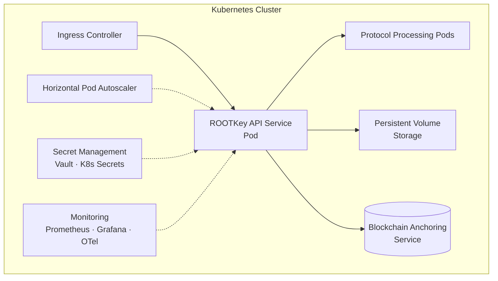

## Overview

ROOTKey's container deployment model is designed for organisations running cloud-native infrastructure - whether on-premise Kubernetes clusters, managed services such as EKS, GKE, or AKS, or multi-cloud architectures.

ROOTKey is distributed as Docker images and Kubernetes Helm charts, enabling deployment through standard GitOps workflows, infrastructure-as-code tooling, and CI/CD pipelines. The platform integrates with existing observability stacks, secret management systems, and ingress controllers without requiring custom configuration.

This model is the recommended choice for teams that already operate containerised infrastructure and want to manage ROOTKey as part of their existing deployment and operational practices.

---

## Architecture Overview

All components are deployed as Kubernetes workloads. The architecture supports horizontal scaling, rolling updates, and zero-downtime deployments through standard Kubernetes primitives.

---

## Typical Use Cases

<CardGroup cols={2}>
  <Card title="Cloud-Native Engineering Teams" icon="cloud">
    Teams already operating Kubernetes who want to manage ROOTKey alongside their existing workloads using familiar tooling - Helm, ArgoCD, Flux, Terraform.
  </Card>
  <Card title="Multi-Cloud Architectures" icon="network-wired">
    Organisations running workloads across multiple cloud providers who require portability and consistent deployment behaviour regardless of underlying infrastructure.
  </Card>
  <Card title="Private Cloud and On-Premise Kubernetes" icon="server">
    Enterprises running on-premise Kubernetes clusters (OpenShift, Rancher, vanilla K8s) requiring full infrastructure control with cloud-native operational patterns.
  </Card>
  <Card title="High-Availability Production Deployments" icon="shield-check">
    Production environments requiring horizontal scaling, automatic failover, and rolling updates without service interruption.
  </Card>
</CardGroup>

---

## Integration Considerations

**Secret management**
API keys, database credentials, and blockchain node endpoints should be injected via Kubernetes Secrets or an external secret management system (e.g. HashiCorp Vault, AWS Secrets Manager). Do not embed credentials in image configuration or Helm values files committed to version control.

**Persistent storage**
Off-chain data storage requires a persistent volume. Storage class selection and volume sizing should be informed by expected data volume and retention policy. ROOTKey supports standard Kubernetes PVC provisioners.

**Ingress and TLS termination**
Configure TLS termination at the ingress layer. ROOTKey's API service communicates internally over HTTP within the cluster; TLS is handled by the ingress controller.

**Observability**
ROOTKey exposes Prometheus-compatible metrics and structured JSON logs. Integrate with your existing monitoring stack (Grafana, Datadog, Dynatrace, or equivalent) using standard scrape configurations.

**Resource sizing**
Initial resource requests and limits are provided in the default Helm values. Adjust based on observed usage patterns and autoscaler metrics after initial deployment.

**Updates and versioning**
New ROOTKey versions are distributed as updated Docker images with corresponding Helm chart versions. Follow semantic versioning; breaking changes are documented in the release notes provided to enterprise clients.

---

<CardGroup cols={2}>
  <Card
    title="Request access to container images"
    icon="docker"
    href="mailto:contact@rootkey.ai"
  >
    Container images and Helm charts are available to enterprise clients. Contact our team to request access and onboarding documentation.
  </Card>
  <Card
    title="Schedule a deployment walkthrough"
    icon="calendar"
    href="https://rootkey.ai/contact?utm_source=api_docs&utm_medium=container&utm_content=demo_cta"
  >
    Our solutions engineering team will guide your team through the deployment process and Kubernetes integration.
  </Card>
</CardGroup>
