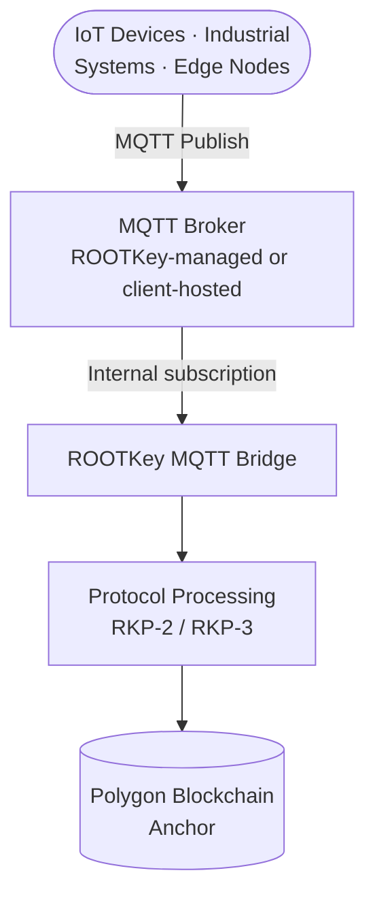

## Overview

ROOTKey's MQTT integration model is designed for environments where the REST API model is architecturally impractical - industrial control systems, IoT device networks, edge deployments, and real-time sensor pipelines that already operate over the MQTT protocol.

MQTT is a lightweight, publish-subscribe messaging protocol designed for constrained environments and unreliable networks. ROOTKey's MQTT integration allows devices and systems to publish data directly into ROOTKey's integrity pipeline without requiring an HTTP stack or persistent connection management.

This model is the recommended choice for Operational Technology (OT) environments, industrial IoT (IIoT) deployments, and any architecture where events are naturally expressed as MQTT messages.

---

## Architecture Overview

Devices publish messages to defined MQTT topics. ROOTKey's MQTT bridge subscribes to those topics, processes incoming payloads through the configured data processing protocol, and anchors the integrity proof to the blockchain.

The result is a tamper-evident, cryptographically verifiable record of every event published through the pipeline - without requiring devices to implement HTTP clients or manage connection state.

---

## Integration Characteristics

| Property | Value |
|----------|-------|
| Protocol version | XXX |
| Supported QoS levels | XXX |
| Maximum message payload size | XXX |
| Broker model | Managed by ROOTKey or client-hosted |
| Authentication | XXX |
| TLS | Required |
| Recommended protocol pairing | RKP-2 (Off-Chain) or RKP-3 (Hybrid) |

---

## Typical Use Cases

<CardGroup cols={2}>
  <Card title="Industrial IoT and SCADA Systems" icon="industry">
    Sensor readings, PLC outputs, and SCADA events published to ROOTKey's integrity pipeline for tamper-evident archiving and regulatory compliance.
  </Card>
  <Card title="Smart Manufacturing" icon="gear">
    Production line telemetry, quality control measurements, and machine event logs anchored in real time without disrupting the OT network architecture.
  </Card>
  <Card title="Energy and Utility Monitoring" icon="bolt">
    Smart meter readings, grid events, and energy consumption data published over MQTT and anchored for regulatory reporting and dispute resolution.
  </Card>
  <Card title="Connected Vehicle and Fleet" icon="truck">
    Vehicle telemetry, GPS events, and condition data published from edge devices and anchored for custody, insurance, and compliance purposes.
  </Card>
  <Card title="Environmental Monitoring" icon="leaf">
    Air quality, water quality, and environmental sensor networks publishing to ROOTKey for regulatory reporting with cryptographic evidence of data integrity.
  </Card>
  <Card title="Building and Facility Management" icon="building">
    BMS sensor data, access logs, and environmental controls published over MQTT for compliance and operational auditing.
  </Card>
</CardGroup>

---

## Integration Considerations

**Broker selection**
ROOTKey supports both a managed broker model (hosted by ROOTKey) and a client-hosted broker model. The managed broker is the fastest path to integration. For environments with network isolation requirements, a client-hosted broker with a controlled egress to ROOTKey's MQTT bridge is the recommended architecture.

**Topic design**
MQTT topic structure maps to ROOTKey vault and asset hierarchy. Topic design should be agreed during the integration scoping phase to ensure correct routing and data classification.

**QoS and delivery guarantees**
Use QoS level 1 or 2 for data that must be reliably delivered to the integrity pipeline. QoS 0 is appropriate for high-frequency telemetry where occasional loss is acceptable. Message ordering and deduplication behaviour depends on the selected QoS level.

**Payload size and frequency**
High-frequency, small-payload workloads are well-suited to RKP-2 (Off-Chain). For mixed workloads where some events require stronger on-chain evidence, RKP-3 (Hybrid) allows per-topic routing configuration.

**Device authentication**
Each device or device class authenticates to the broker using credentials scoped to the target ROOTKey workspace. Credential rotation policies should be defined as part of the device lifecycle management process.

**OT/IT convergence**
For environments where MQTT brokers sit within the OT network boundary, ROOTKey supports a broker bridge architecture that relays messages across the OT/IT boundary without exposing OT systems directly to external networks.

---

<CardGroup cols={2}>
  <Card
    title="Request a technical scoping call"
    icon="calendar"
    href="https://rootkey.ai/contact?utm_source=api_docs&utm_medium=mqtt&utm_content=demo_cta"
  >
    MQTT deployments are scoped per environment. Our engineering team will assess your broker topology, device architecture, and data classification requirements.
  </Card>
  <Card
    title="Contact enterprise sales"
    icon="envelope"
    href="mailto:contact@rootkey.ai"
  >
    Discuss MQTT integration options, broker models, and enterprise agreement terms.
  </Card>
</CardGroup>
