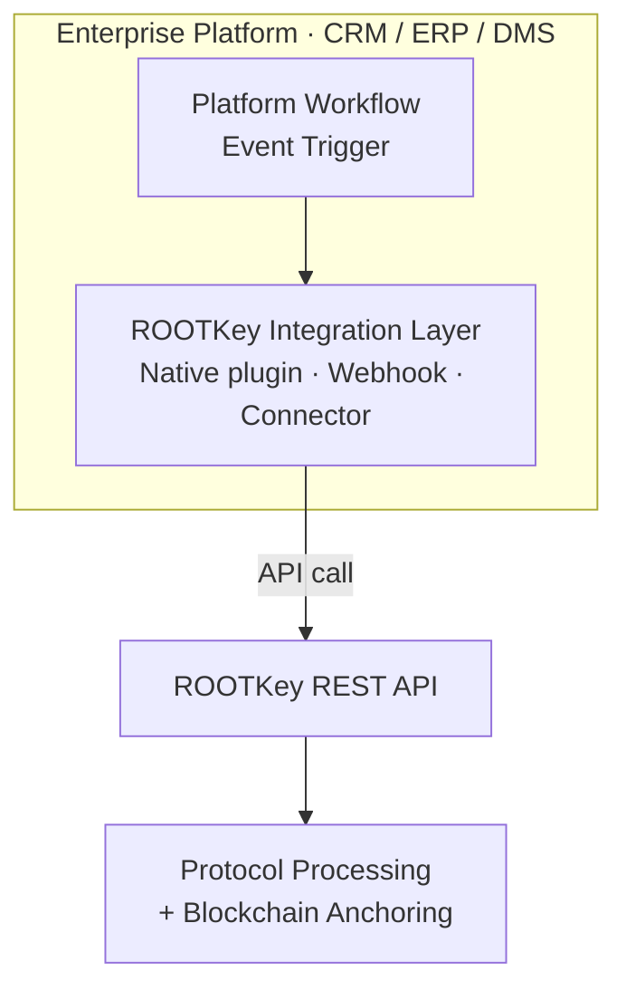

## Overview

ROOTKey's native integration model embeds data integrity capabilities directly into the enterprise platforms your teams already use - CRMs, ERPs, document management systems, and operational platforms - without requiring developers to interact with the ROOTKey API directly.

Native integrations surface ROOTKey as a native feature within the host platform: anchoring records at creation or modification events, triggering validation on demand, and surfacing integrity status within existing workflows. The user experience is seamless; the underlying mechanism is ROOTKey's blockchain-backed integrity layer.

Native integrations are built to specification through ROOTKey's engineering team or through ROOTKey's certified partner network. There are no pre-packaged plugins that require self-service installation - every integration is designed for the specific version, configuration, and workflow of the target platform.

---

## Architecture Overview

The integration layer is implemented at the platform level - as a native plugin, a workflow automation connector, or an embedded API wrapper - depending on the extensibility model of the target platform. ROOTKey's data integrity layer operates transparently behind the existing UI and workflow.

---

## Integration Characteristics

| Property | Value |
|----------|-------|
| Integration model | Native plugin / connector / embedded wrapper |
| Build model | Built to specification by ROOTKey or certified partner |
| Target platforms | CRMs, ERPs, DMS, operational platforms |
| API contract | Full ROOTKey REST API (abstracted from end user) |
| Protocol support | RKP-1, RKP-2, RKP-3 (configured per integration) |
| Customisation | Scoped per platform and workflow requirements |

---

## Supported Platform Categories

<CardGroup cols={2}>
  <Card title="Customer Relationship Management (CRM)" icon="users">
    Anchor customer records, contracts, and communication logs at creation or modification events. Surface integrity status directly within the CRM interface.
  </Card>
  <Card title="Enterprise Resource Planning (ERP)" icon="sitemap">
    Embed tamper-evident audit trails into procurement, finance, and supply chain workflows. Anchor purchase orders, invoices, and approval events.
  </Card>
  <Card title="Document Management Systems (DMS)" icon="folder-open">
    Automatically anchor documents at upload or approval. Provide version integrity and provenance for regulated document workflows.
  </Card>
  <Card title="Operational and ITSM Platforms" icon="headset">
    Anchor incident records, change requests, and operational events for compliance reporting and post-incident forensics.
  </Card>
  <Card title="Industry-Specific Platforms" icon="industry">
    Healthcare information systems, legal matter management, financial platforms, and sector-specific tools - integrated through ROOTKey's partner network.
  </Card>
  <Card title="Custom Internal Platforms" icon="code">
    Internally developed platforms and proprietary tooling - embedded through ROOTKey's API with platform-specific UX built to your requirements.
  </Card>
</CardGroup>

---

## Integration Considerations

**Scoping and discovery**
Every native integration begins with a scoping engagement. ROOTKey's solutions engineering team assesses the target platform's extensibility model, the specific workflows to be instrumented, and the data classification requirements. A technical specification is produced before development begins.

**Build model**
Integrations are built either by ROOTKey's engineering team directly or by a certified integration partner. The choice depends on the platform, the complexity of the integration, and the client's preferred engagement model. Both paths deliver the same API capability and support standards.

**Platform versioning**
Native integrations are version-specific. When the host platform is updated, the integration may require re-validation or updates. ROOTKey and certified partners provide a defined maintenance model covering platform version support.

**Data classification**
Workflow triggers and the data passed to ROOTKey are defined during scoping. Data classification - what is anchored, what is hashed, and what is excluded - is agreed contractually and documented in the integration specification.

**User experience**
The ROOTKey layer is invisible to end users by default. Integrity status, validation results, and audit references can be surfaced within the host platform UI as part of the integration design - without requiring users to access the ROOTKey dashboard.

**Certification and compliance**
Integration artefacts (architecture diagrams, data flow documentation, API usage scope) are provided to support client compliance assessments and vendor risk reviews.

---

<CardGroup cols={2}>
  <Card
    title="Request an integration consultation"
    icon="calendar"
    href="https://rootkey.ai/contact?utm_source=api_docs&utm_medium=native&utm_content=demo_cta"
  >
    Tell us which platform you need ROOTKey integrated into. Our solutions team will assess feasibility, define the integration scope, and propose a delivery model.
  </Card>
  <Card
    title="Contact enterprise sales"
    icon="envelope"
    href="mailto:contact@rootkey.ai"
  >
    Discuss integration timelines, partner engagement, and enterprise agreement terms.
  </Card>
</CardGroup>
