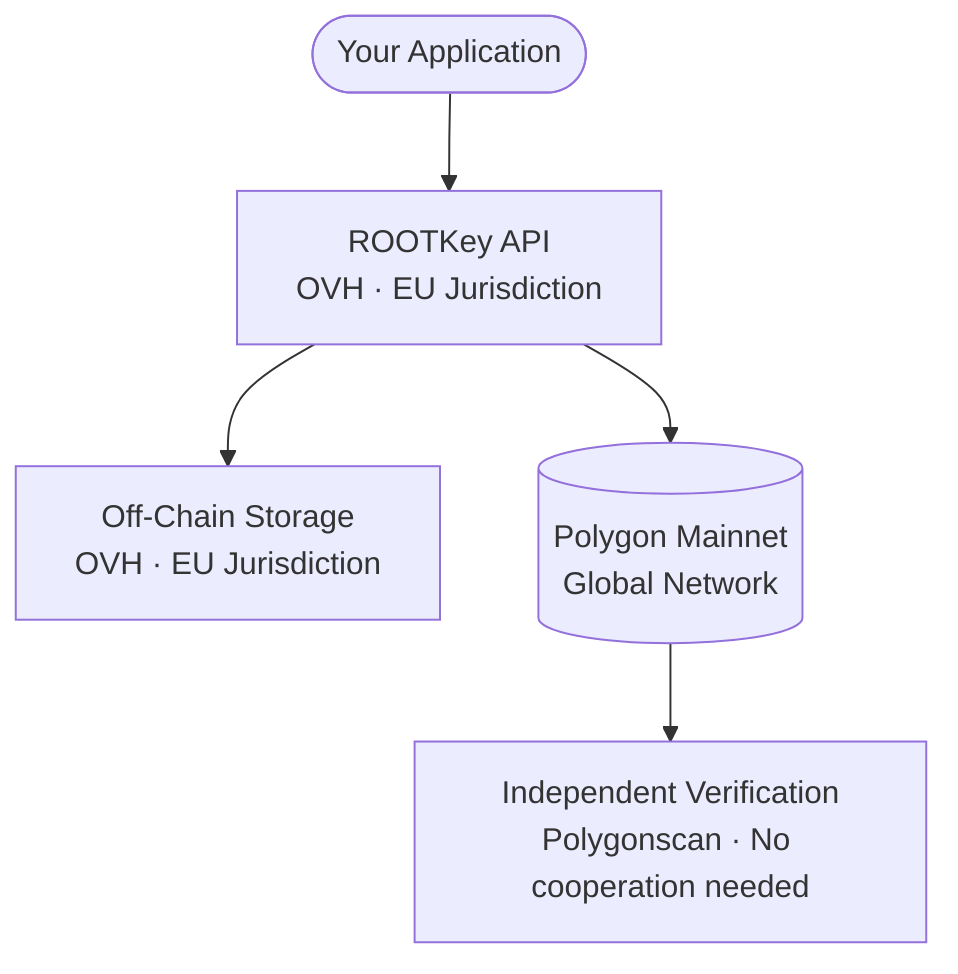

<Note>
  This is a sovereignty variant of [RKP-1 (Full On-Chain)](/pages/protocols/rkp-1-on-chain). The anchoring mechanics are identical - the difference is the cloud infrastructure used for off-chain processing and storage.
</Note>

## Sovereignty Profile

| Component | Provider | Jurisdiction | Notes |
|-----------|----------|-------------|-------|
| **Blockchain** | Polygon (PoS) | Global | Public distributed network - no single jurisdiction controls it |
| **Cloud / API processing** | OVH | EU (France) | Dedicated deployment on OVH Managed Kubernetes; no US parent company; no CLOUD Act exposure |
| **Off-chain storage** | OVH | EU | Data remains in EU jurisdiction at rest and in transit |
| **Sovereignty level** | **Partial EU** | EU cloud + global blockchain | Cloud sovereign; blockchain not EU-exclusive |

**When to choose this variant:** Your regulatory environment requires EU cloud data residency (GDPR, national cloud policies) but does not specifically mandate that the blockchain infrastructure itself be EU-operated or under EU jurisdiction.

---

## How It Differs from RKP-1 Standard

| Property | RKP-1 Standard | RKP-1 Enhanced EU |
|----------|---------------|------------------|
| Blockchain | Polygon | Polygon |
| Cloud provider | Azure / AWS | **OVH (dedicated deployment)** |
| Cloud jurisdiction | US-incorporated (EU regions) | **EU-incorporated (France)** |
| CLOUD Act exposure | Yes - Microsoft / Amazon subject to US law | **No - OVH not subject to CLOUD Act** |
| Blockchain jurisdiction | Global | Global |
| Data residency | EU region configurable | **EU guaranteed** |
| Anchoring mechanics | SHA-256 → Polygon | SHA-256 → Polygon (unchanged) |
| Availability | Standard | On request |

---

## Anchoring Architecture

The only component outside EU legal jurisdiction is the Polygon blockchain itself - which is a permissionless, distributed network operated by no single entity and subject to no single national law.

---

## Regulatory Frameworks Addressed

| Framework | How RKP-1 Enhanced EU helps |
|-----------|----------------------------|
| **GDPR** | Personal data processed on OVH (EU) - no transfer to US-controlled infrastructure |
| **NIS2** | EU cloud for critical entity operators who cannot rely on US-controlled infrastructure |
| **DORA** | ICT third-party risk: OVH removes US CLOUD Act exposure from the risk assessment |
| **ISO 27001** | EU-resident data processing supports data residency controls |

---

## Configuration

RKP-1 Enhanced EU is a dedicated deployment of the ROOTKey platform on OVH, provisioned on request. No changes to your API integration are required - the anchoring API endpoints and request format are identical to RKP-1 Standard; only the base URL points to the dedicated deployment.

Contact our team to scope an OVH-backed deployment.

→ [Request EU cloud deployment](https://rootkey.ai/contact?utm_source=api_docs&utm_medium=rkp1_eu&utm_content=demo_cta)

---

## Beyond Enhanced EU

If your regulatory environment requires that **the blockchain record itself** be under EU jurisdiction - not only the cloud infrastructure - that is [RKP-1 Sovereign EU](/pages/protocols/rkp-1-sovereign), which is on the roadmap (on-premise deployment with a private chain). If on-chain evidence is not a hard requirement, [RKP-2 Sovereign EU](/pages/protocols/rkp-2-sovereign) keeps everything inside your own infrastructure today.
