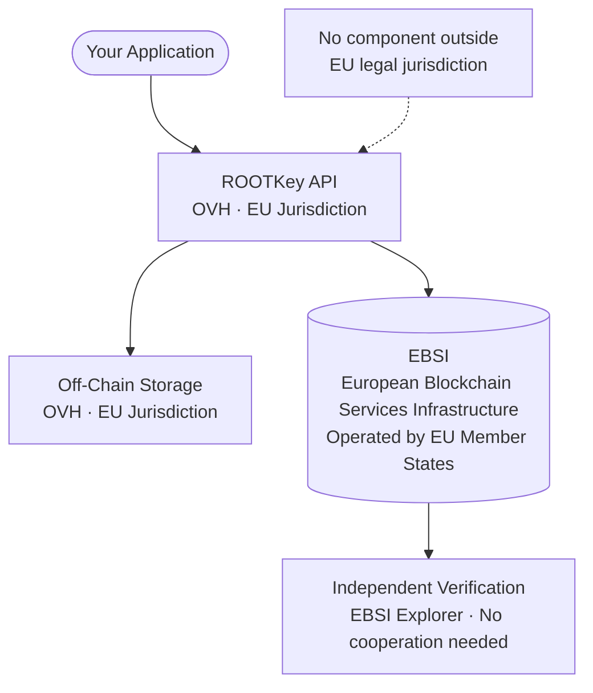

<Note>
  This is the highest-sovereignty variant of [RKP-1 (Full On-Chain)](/pages/protocols/rkp-1-on-chain). The anchoring mechanics are identical - the difference is that both the cloud infrastructure and the blockchain are EU-operated and EU-governed.
</Note>

## Sovereignty Profile

| Component | Provider | Jurisdiction | Notes |
|-----------|----------|-------------|-------|
| **Blockchain** | EBSI | EU | European Blockchain Services Infrastructure - operated by the European Commission and EU member states |
| **Cloud / API processing** | OVH | EU (France) | No US parent company; no CLOUD Act exposure; SecNumCloud certified |
| **Off-chain storage** | OVH | EU | Data remains in EU jurisdiction at rest and in transit |
| **Sovereignty level** | **Full EU** | 100% EU jurisdiction | No component subject to non-EU law |

**When to choose this variant:** Your regulatory environment, national security classification, or contractual obligations require that no part of the integrity infrastructure - cloud, storage, or blockchain - is subject to non-EU jurisdiction or accessible by non-EU authorities.

---

## What Is EBSI?

**EBSI** (European Blockchain Services Infrastructure) is the EU's own blockchain network, operated by the European Commission in collaboration with EU member state governments. It was designed for EU public sector use cases - including the European Digital Identity Wallet (EUDIW), educational credential verification, and government document authenticity.

| Property | Polygon | EBSI |
|----------|---------|------|
| Operator | Permissionless (no single operator) | European Commission + EU member states |
| Governance | Decentralised community | EU public authorities |
| Node location | Globally distributed | EU member state infrastructure |
| Jurisdiction | No single jurisdiction | EU law |
| Public verifiability | Yes - Polygonscan | Yes - EBSI explorer |
| Primary use cases | General-purpose Web3 | EU government and regulated applications |
| EU Digital Identity Wallet | No | Yes |

---

## How It Differs from RKP-1 Standard and RKP-1 Enhanced EU

| Property | RKP-1 Standard | RKP-1 Enhanced EU | RKP-1 Sovereign EU |
|----------|---------------|------------------|-------------------|
| Blockchain | Polygon | Polygon | **EBSI** |
| Cloud provider | Azure / AWS | OVH | **OVH** |
| Blockchain jurisdiction | Global | Global | **EU** |
| Cloud jurisdiction | US-incorporated | EU-incorporated | **EU-incorporated** |
| CLOUD Act exposure | Yes | No | **No** |
| Full EU sovereignty | No | No | **Yes** |
| Available on request | - | Contact team | **Contact team** |

---

## Anchoring Architecture

---

## Regulatory Frameworks Addressed

| Framework | How RKP-1 Sovereign EU helps |
|-----------|------------------------------|
| **GDPR** | All processing on EU infrastructure - no transfer risk under Chapter V |
| **NIS2 - Critical Infrastructure** | Satisfies national sovereignty requirements for essential entity operators where non-EU infrastructure is excluded |
| **DORA** | Removes CLOUD Act risk entirely - no US-controlled infrastructure in the ICT supply chain |
| **EU Cybersecurity Act (EUCS)** | Aligned with High assurance level requirements for sensitive EU-operated workloads |
| **SecNumCloud (ANSSI)** | OVH certification satisfies French national cloud security requirements |
| **BSI C5 (Germany)** | OVH holds BSI C5 attestation - satisfies German federal requirements |
| **EU Digital Identity Wallet (EUDIW)** | EBSI is the native blockchain for EUDIW credential anchoring |
| **Public sector procurement (EU)** | Satisfies EU preference for European digital infrastructure in regulated procurement |

---

## Use Cases Best Suited to RKP-1 Sovereign EU

<CardGroup cols={2}>
  <Card title="National critical infrastructure" icon="tower-broadcast">
    Energy, water, transport, and digital infrastructure operators subject to NIS2 with national classification requirements.
  </Card>
  <Card title="EU government and public sector" icon="landmark">
    Public authorities anchoring administrative records, official documents, and regulatory filings under EU law.
  </Card>
  <Card title="EU Digital Identity Wallet workflows" icon="id-card">
    Credential issuers and verifiers participating in the EUDIW ecosystem, where EBSI anchoring is native.
  </Card>
  <Card title="Defence-adjacent and classified environments" icon="shield-halved">
    Organisations with obligations or preferences against relying on non-EU blockchain networks for integrity proofs.
  </Card>
</CardGroup>

---

## Availability

RKP-1 Sovereign EU is available **on request** for organisations with demonstrated sovereignty requirements. Deployment involves:

1. Dedicated OVH tenancy for API processing and storage
2. EBSI network configuration for blockchain anchoring
3. EU-law-governed data processing agreement
4. Modified API endpoints scoped to the sovereign deployment

→ [Request RKP-1 Sovereign EU deployment](https://rootkey.ai/contact?utm_source=api_docs&utm_medium=rkp1_sovereign&utm_content=demo_cta)
