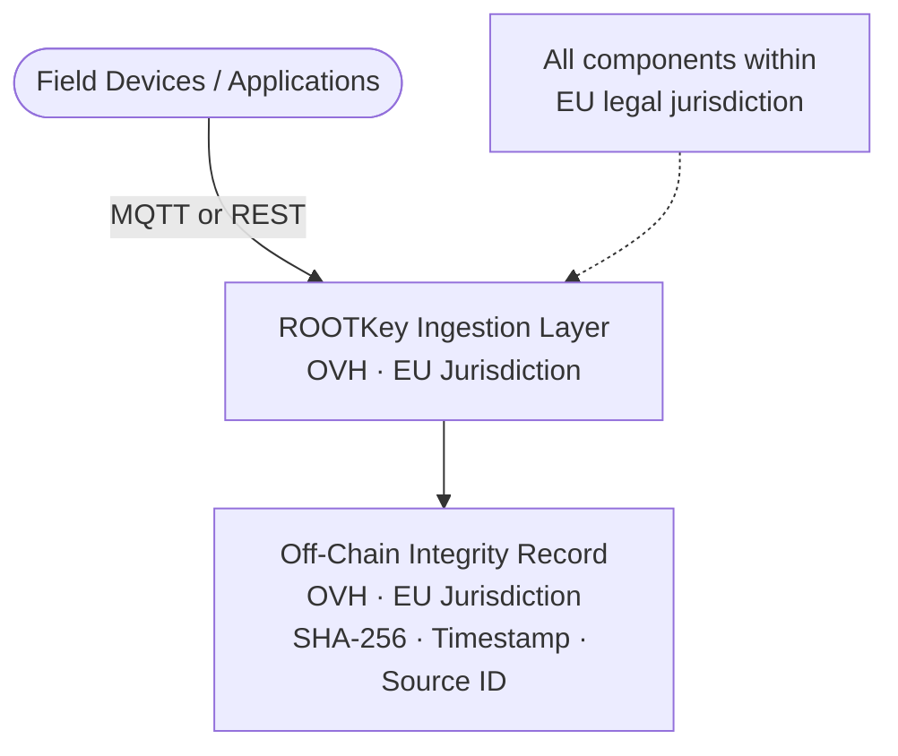

<Note>
  This is a sovereignty variant of [RKP-2 (Off-Chain)](/pages/protocols/rkp-2-off-chain). The anchoring mechanics are identical - the difference is the cloud infrastructure used for all data processing and storage.
</Note>

## Sovereignty Profile

| Component | Provider | Jurisdiction | Notes |
|-----------|----------|-------------|-------|
| **Off-chain storage** | OVH | EU (France) | All data and metadata remain in EU jurisdiction |
| **Cloud / API processing** | OVH | EU (France) | No US parent; no CLOUD Act exposure; SecNumCloud certified |
| **Blockchain** | None (off-chain protocol) | - | RKP-2 does not use on-chain anchoring |
| **Sovereignty level** | **Full EU (cloud)** | 100% EU cloud jurisdiction | No blockchain component to consider |

**When to choose this variant:** You require high-frequency, high-volume integrity anchoring (IoT, sensor data, event streams) and your data must not be processed on US-incorporated cloud infrastructure.

<Info>
  Because RKP-2 has no blockchain component, hosting on OVH is sufficient to achieve full EU cloud sovereignty. There is no blockchain-tier sovereignty distinction for RKP-2 - this variant (Enhanced EU) is equivalent to the maximum sovereignty level achievable under the off-chain protocol.
</Info>

---

## How It Differs from RKP-2 Standard

| Property | RKP-2 Standard | RKP-2 Enhanced EU |
|----------|---------------|------------------|
| Cloud provider | Azure / AWS | **OVH** |
| Cloud jurisdiction | US-incorporated (EU regions) | **EU-incorporated (France)** |
| CLOUD Act exposure | Yes | **No** |
| SecNumCloud | No | **Yes** |
| BSI C5 | No | **Yes** |
| Blockchain | None | None |
| Data residency | EU region configurable | **EU guaranteed** |
| Anchoring throughput | Same | Same |
| Cost profile | Same | Same |

---

## Architecture

---

## Regulatory Frameworks Addressed

| Framework | How RKP-2 Enhanced EU helps |
|-----------|-----------------------------|
| **GDPR** | Sensor and telemetry metadata processed on OVH - no Chapter V transfer exposure |
| **NIS2 - OT/SCADA** | EU cloud for industrial data integrity in energy, water, and transport |
| **IEC 62443** | EU-resident processing for IACS data integrity workloads |
| **EU Energy Regulation** | Smart meter and energy measurement data anchored on EU infrastructure |
| **ISO 50001** | Energy management measurement data on EU-sovereign infrastructure |
| **SecNumCloud (ANSSI)** | OVH certification satisfies French requirements for processing operational data |

---

## Ideal Workloads

<CardGroup cols={2}>
  <Card title="IoT and sensor data" icon="microchip">
    High-frequency sensor readings, environmental monitoring, smart meter data - anchored on EU infrastructure, compliant with GDPR and NIS2.
  </Card>
  <Card title="OT / SCADA telemetry" icon="gauge">
    Industrial control system event streams where EU data residency and non-US cloud infrastructure are required.
  </Card>
  <Card title="Healthcare monitoring" icon="heart-pulse">
    Patient monitoring and wearable device data - EU cloud ensures no US-controlled processing of health data.
  </Card>
  <Card title="Environmental compliance" icon="leaf">
    Regulatory environmental monitoring data (air quality, emissions, water) anchored on EU infrastructure for regulatory submission.
  </Card>
</CardGroup>

---

## Configuration

RKP-2 Enhanced EU is available as a workspace configuration option. The MQTT and REST integration remains unchanged - only the backend processing infrastructure is routed to OVH.

Contact our team to configure your workspace for OVH-backed processing.

→ [Request EU cloud configuration](https://rootkey.ai/contact?utm_source=api_docs&utm_medium=rkp2_eu&utm_content=demo_cta)

→ [MQTT Deployment Guide](/pages/deployment/mqtt) · [IoT & Industrial use case](/use-cases/iot-industrial)
