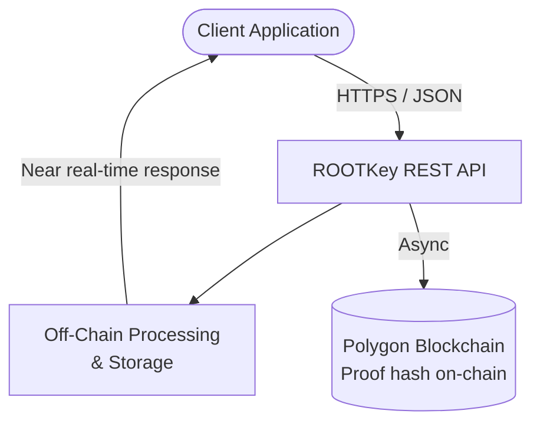

## Overview

**RKP-2 (Off-Chain)** is ROOTKey's high-performance data processing protocol. Data is processed and stored off-chain through ROOTKey's infrastructure, while a cryptographic proof - a SHA-256 hash of the payload - is anchored asynchronously to the Polygon blockchain.

The result is near real-time API response times with blockchain-backed integrity guarantees. Verification relies on hash comparison between the original data and the on-chain proof, without requiring the full payload to be written to the chain.

This protocol is designed for high-frequency write workloads, IoT and sensor data, operational telemetry, and any scenario where throughput and cost efficiency are primary constraints, but cryptographic integrity remains non-negotiable.

---

## Architecture Overview

The API returns a response immediately after off-chain processing completes. Blockchain anchoring occurs asynchronously within a defined window. This design decouples response latency from block confirmation time while preserving the integrity guarantee.

Each anchored record includes:

- **SHA-256 hash** of the data payload
- **Anchor timestamp** (block timestamp)
- **Asset and operation identifiers**

Integrity verification is performed by re-hashing the stored data and comparing against the on-chain record - a process that can be independently executed by any party with access to the data and blockchain.

---

## Request Limits and Throughput

| Parameter | Value |
|-----------|-------|
| Maximum requests per second | XXX |
| Maximum concurrent operations | XXX |
| Maximum payload size per request | XXX |
| Burst allowance | XXX |

For plan-specific throughput limits, visit [Pricing](/pages/pricing).

---

## Performance Indicators

| Metric | Value |
|--------|-------|
| Average API response latency | XXX ms |
| P95 API response latency | XXX ms |
| Async blockchain anchoring window | XXX ms |
| Recovery time objective (RTO) | XXX |
| Recovery point objective (RPO) | XXX |

> The API response is independent of blockchain confirmation time. Anchoring occurs within a guaranteed window after the API call completes.

---

## Validation Capabilities

| Validation Type | Supported |
|-----------------|-----------|
| Hash-based integrity verification | Yes |
| On-chain proof of existence | Yes |
| On-chain proof of integrity (hash match) | Yes |
| Independent verification by third parties | Yes (requires access to original data + blockchain) |
| Full payload retrieval from blockchain | No (off-chain storage) |
| GDPR-compatible erasure of off-chain data | Yes |

Verification requires access to the original data asset and the on-chain hash. Any party holding the data can independently confirm its integrity by recomputing the hash and comparing it to the on-chain record.

---

## Strengths

- **High throughput** - designed for large-scale, high-frequency write workloads
- **Near real-time response** - API latency is decoupled from blockchain confirmation
- **Lower cost per operation** - off-chain processing reduces gas fee exposure per request
- **GDPR erasure compatibility** - off-chain data can be deleted; the on-chain proof remains as evidence of prior existence without containing personal data
- **Scalable to IoT scale** - supports high-volume sensor and device data pipelines
- **Same integrity guarantees** - cryptographic proof anchored on-chain regardless of throughput

---

## Weaknesses

- **Partial on-chain footprint** - only the proof is on-chain; full record recovery requires ROOTKey off-chain storage or client-side copy
- **Verification requires original data** - third-party verification is not self-contained from the blockchain alone
- **Storage dependency** - integrity of the verification chain depends on the availability of the off-chain record

---

## Typical Use Cases

<CardGroup cols={2}>
  <Card title="Industrial IoT and Sensor Networks" icon="microchip">
    High-frequency telemetry from sensors, PLCs, and connected devices - integrity-protected at volume without per-record blockchain costs.
  </Card>
  <Card title="Operational Telemetry and Monitoring" icon="chart-line">
    Real-time operational logs, system events, and monitoring streams requiring tamper-evident archiving at scale.
  </Card>
  <Card title="Healthcare Data Pipelines" icon="heart-pulse">
    Patient records, diagnostic data, and clinical trial logs where volume is high, integrity is mandatory, and GDPR compliance requires erasure capability.
  </Card>
  <Card title="Energy and Utility Metering" icon="bolt">
    Smart meter readings, grid event logs, and consumption records for regulatory reporting and dispute resolution.
  </Card>
  <Card title="Logistics and Fleet Tracking" icon="truck">
    GPS events, custody transfers, and condition monitoring data for perishable or high-value cargo.
  </Card>
  <Card title="Bulk Document Archiving" icon="folder-open">
    Large-volume document archiving for regulated industries where every record requires integrity evidence but full on-chain costs are prohibitive.
  </Card>
</CardGroup>

---

## Compliance Alignment

| Framework | Alignment |
|-----------|-----------|
| **NIS2 Directive** | Supports Article 21 requirements for data integrity and availability of critical infrastructure systems |
| **ISO 27001** *(in progress)* | Aligns with A.8.15 (logging), A.8.12 (data leakage prevention), A.5.33 (protection of records) |
| **GDPR** | Native compatibility - off-chain data is erasable; on-chain proof contains no personal data |
| **DORA** | Supports operational resilience logging and audit trail requirements for financial entities |
| **IEC 62443** | Applicable to industrial control system data integrity requirements in OT environments |

<Note>
ROOTKey is actively pursuing NIS2 alignment and ISO 27001 certification. Contact us at [contact@rootkey.ai](mailto:contact@rootkey.ai) for the current compliance posture and available documentation.
</Note>

---

<CardGroup cols={2}>
  <Card
    title="Get started with a free account"
    icon="rocket"
    href="https://app.rootkey.ai?utm_source=api_docs&utm_medium=rkp2&utm_content=signup_cta"
  >
    Access sandbox and live environments immediately. No commitment required.
  </Card>
  <Card
    title="Request a technical briefing"
    icon="calendar"
    href="https://rootkey.ai/contact?utm_source=api_docs&utm_medium=rkp2&utm_content=briefing_cta"
  >
    Discuss your data pipeline architecture and throughput requirements with our engineering team.
  </Card>
</CardGroup>
