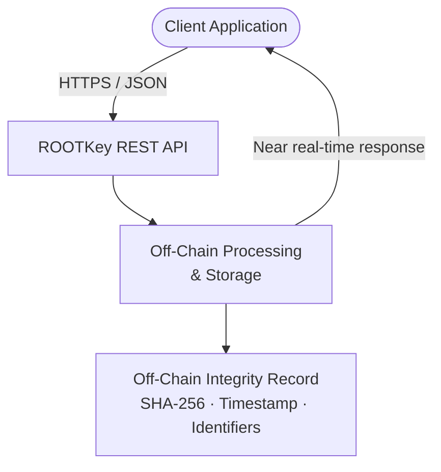

<Warning>
  **In development.** RKP-2 (Off-Chain) is a feature under development and is not available yet. This page describes the intended design, which may change before release.
</Warning>

## Overview

**RKP-2 (Off-Chain)** is ROOTKey's high-performance data processing protocol. Data is processed and stored off-chain through ROOTKey's infrastructure, and each operation produces an off-chain integrity record - a SHA-256 hash of the payload with its timestamp and identifiers. Nothing is written to a blockchain.

The result is near real-time API response times with hash-based integrity verification. Verification compares a fresh hash of the data against the integrity record held by ROOTKey.

This protocol is designed for high-frequency write workloads, IoT and sensor data, operational telemetry, and any scenario where throughput and cost efficiency are primary constraints, but cryptographic integrity remains non-negotiable. When some records need independently verifiable on-chain evidence, use [RKP-3 (Hybrid)](/pages/protocols/rkp-3-hybrid) or [RKP-1 (Full On-Chain)](/pages/protocols/rkp-1-on-chain).

---

## Architecture Overview

```mermaid
flowchart TD
    A([Client Application]) -->|HTTPS / JSON| B[ROOTKey REST API]
    B --> C[Off-Chain Processing\n& Storage]
    C --> D[Off-Chain Integrity Record\nSHA-256 · Timestamp · Identifiers]
    C -->|Near real-time response| A
```

The API returns a response as soon as off-chain processing completes. There is no blockchain confirmation in the write path, so latency is not tied to block times or network fees.

Each integrity record includes:

- **SHA-256 hash** of the data payload
- **Timestamp** of the operation
- **Asset and operation identifiers**

Integrity verification is performed by re-hashing the stored data and comparing it against the integrity record.

---

{/*
  TODO: Request limits and performance figures are hidden until they are measured.
  Restore these sections once the values are tested and calculated - do not publish estimates.

## Request Limits and Throughput

| Parameter | Value |
|-----------|-------|
| Maximum requests per second | XXX |
| Maximum concurrent operations | XXX |
| Maximum payload size per request | XXX |
| Burst allowance | XXX |

For plan-specific throughput limits, visit [Rate Limits](/pages/rate-limits).

---

## Performance Indicators

| Metric | Value |
|--------|-------|
| Average API response latency | XXX ms |
| P95 API response latency | XXX ms |
| Recovery time objective (RTO) | XXX |
| Recovery point objective (RPO) | XXX |

---
*/}

## Validation Capabilities

| Validation Type | Supported |
|-----------------|-----------|
| Hash-based integrity verification | Yes |
| Proof of existence (off-chain integrity record) | Yes |
| On-chain proof of existence or integrity | No (no blockchain component) |
| Independent verification by third parties | Partial (requires the original data and access to the ROOTKey integrity record) |
| GDPR-compatible erasure of off-chain data | Yes |

Verification requires the original data asset and its integrity record. A party holding the data can confirm its integrity by recomputing the hash and comparing it to the record - but, unlike RKP-1 and RKP-3, the record is held by ROOTKey rather than on a public ledger.

---

## Strengths

- **High throughput** - designed for large-scale, high-frequency write workloads
- **Near real-time response** - no blockchain confirmation in the write path
- **Lowest cost per operation** - no gas fees, since nothing is written on-chain
- **GDPR erasure compatibility** - all data is off-chain and can be deleted
- **Scalable to IoT scale** - supports high-volume sensor and device data pipelines

---

## Weaknesses

- **No on-chain evidence** - there is no public-ledger record; verification relies on the ROOTKey integrity record rather than on a decentralised source of trust
- **Verification requires original data** - third-party verification needs both the data and access to the integrity record
- **Storage dependency** - verification depends on the availability of the off-chain integrity record

---

## Typical Use Cases

<CardGroup cols={2}>
  <Card title="Industrial IoT and Sensor Networks" icon="microchip">
    High-frequency telemetry from sensors, PLCs, and connected devices - integrity-protected at volume without per-record blockchain costs.
  </Card>
  <Card title="Operational Telemetry and Monitoring" icon="chart-line">
    Real-time operational logs, system events, and monitoring streams requiring tamper-evident archiving at scale.
  </Card>
  <Card title="Healthcare Data Pipelines" icon="heart-pulse">
    Patient records, diagnostic data, and clinical trial logs where volume is high, integrity is mandatory, and GDPR compliance requires erasure capability.
  </Card>
  <Card title="Energy and Utility Metering" icon="bolt">
    Smart meter readings, grid event logs, and consumption records for regulatory reporting and dispute resolution.
  </Card>
  <Card title="Logistics and Fleet Tracking" icon="truck">
    GPS events, custody transfers, and condition monitoring data for perishable or high-value cargo.
  </Card>
  <Card title="Bulk Document Archiving" icon="folder-open">
    Large-volume document archiving for regulated industries where every record requires integrity evidence but full on-chain costs are prohibitive.
  </Card>
</CardGroup>

---

## Compliance Alignment

| Framework | Alignment |
|-----------|-----------|
| **NIS2 Directive** | Supports Article 21 requirements for data integrity and availability of critical infrastructure systems |
| **ISO 27001** *(in progress)* | Aligns with A.8.15 (logging), A.8.12 (data leakage prevention), A.5.33 (protection of records) |
| **GDPR** | Native compatibility - all data is off-chain and erasable; nothing is written to an immutable ledger |
| **DORA** | Supports operational resilience logging and audit trail requirements for financial entities |
| **IEC 62443** | Applicable to industrial control system data integrity requirements in OT environments |

<Note>
ROOTKey is actively pursuing NIS2 alignment and ISO 27001 certification. Contact us at [contact@rootkey.ai](mailto:contact@rootkey.ai) for the current compliance posture and available documentation.
</Note>

---

<CardGroup cols={2}>
  <Card
    title="Get started with a free account"
    icon="rocket"
    href="https://app.rootkey.ai?utm_source=api_docs&utm_medium=rkp2&utm_content=signup_cta"
  >
    Access sandbox and live environments immediately. No commitment required.
  </Card>
  <Card
    title="Request a technical briefing"
    icon="calendar"
    href="https://rootkey.ai/contact?utm_source=api_docs&utm_medium=rkp2&utm_content=briefing_cta"
  >
    Discuss your data pipeline architecture and throughput requirements with our engineering team.
  </Card>
</CardGroup>
