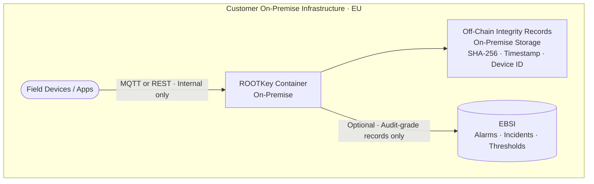

<Note>
  This is the highest-sovereignty variant of [RKP-2 (Off-Chain)](/pages/protocols/rkp-2-off-chain). Unlike RKP-2 Enhanced EU, which uses OVH-hosted infrastructure, RKP-2 Sovereign EU runs entirely within the customer's own on-premise EU environment - with optional EBSI anchoring for audit-grade proofs.
</Note>

## Sovereignty Profile

| Component | Provider | Jurisdiction | Notes |
|-----------|----------|-------------|-------|
| **Off-chain storage** | Customer on-premise | Customer EU facility | Data never leaves the organisation's infrastructure |
| **API processing** | Customer on-premise | Customer EU facility | ROOTKey deployed as a containerised workload |
| **Blockchain (optional)** | EBSI | EU | Selective elevation of critical records to EBSI for audit-grade proofs |
| **Sovereignty level** | **Full EU - Air-gapped capable** | 100% customer infrastructure | Maximum data control; no dependency on ROOTKey cloud |

**When to choose this variant:** Your organisation cannot allow operational data to leave its own infrastructure perimeter - whether for national security, sector regulation, or contractual reasons - while still needing cryptographic integrity verification for audit and compliance purposes.

---

## How It Differs Across the RKP-2 Variants

| Property | RKP-2 Standard | RKP-2 Enhanced EU | RKP-2 Sovereign EU |
|----------|---------------|------------------|--------------------|
| Cloud provider | Azure / AWS | OVH | **None - on-premise** |
| Data leaves organisation | Yes | Yes (to OVH) | **No** |
| API processing location | ROOTKey cloud | ROOTKey OVH | **Customer infrastructure** |
| Blockchain | None | None | **EBSI (optional, selective)** |
| Full sovereignty | No | Cloud sovereign | **Yes - air-gap capable** |
| Deployment model | SaaS | SaaS on OVH | **[Container / On-Premise](/pages/deployment/on-premise)** |
| Availability | Standard | Contact team | **Contact team** |

---

## Architecture

---

## Selective EBSI Anchoring

RKP-2 Sovereign EU processes high-frequency data entirely on-premise. For records that require the highest level of audit defensibility - regulatory measurements, safety events, incident records, threshold breaches - the on-premise ROOTKey deployment can selectively elevate those records to EBSI:

| Record type | Recommended anchoring |
|-------------|----------------------|
| Routine sensor readings | Off-chain only (on-premise) |
| Threshold breach events | Selective EBSI anchor |
| Alarm and safety events | Selective EBSI anchor |
| Regulatory measurement records | Selective EBSI anchor |
| Incident records | Selective EBSI anchor |

This pattern preserves throughput and cost efficiency for bulk telemetry while ensuring that the records most likely to face regulatory scrutiny have the highest possible evidentiary standing.

---

## Regulatory Frameworks Addressed

| Framework | How RKP-2 Sovereign EU helps |
|-----------|------------------------------|
| **NIS2 - Critical Infrastructure (highest tier)** | On-premise deployment satisfies national sovereignty requirements where cloud infrastructure (even EU) is restricted |
| **IEC 62443 - SL 3/SL 4** | Highest Security Level data integrity for IACS environments with strict perimeter requirements |
| **EU Energy (classified measurements)** | Regulatory measurement data never leaves the operator's infrastructure |
| **Defence-adjacent OT** | OT integrity anchoring without any external data dependency |
| **Air-gapped environments** | EBSI anchoring can be configured for batched outbound-only connectivity - no inbound connection required |
| **Healthcare (on-premise ICU/operating)** | Patient monitoring data stays within hospital infrastructure |

---

## Deployment Requirements

RKP-2 Sovereign EU is deployed as a containerised workload within the customer's infrastructure:

- Docker or Kubernetes environment on customer-controlled EU infrastructure
- MQTT broker accessible within the customer network
- Optional outbound HTTPS connection to EBSI for selective anchoring (no inbound required)
- Customer-managed storage for off-chain records

→ [Container Deployment Guide](/pages/deployment/container) · [On-Premise Deployment](/pages/deployment/on-premise)

---

## Availability

RKP-2 Sovereign EU is available on request. Deployment involves a sizing assessment, container configuration, and optionally a EBSI node or gateway configuration for selective anchoring.

→ [Request RKP-2 Sovereign EU deployment](https://rootkey.ai/contact?utm_source=api_docs&utm_medium=rkp2_sovereign&utm_content=demo_cta)
