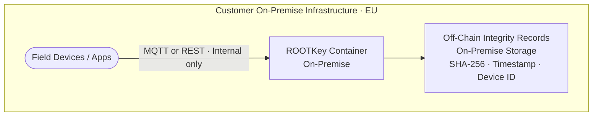

<Note>
  This is the highest-sovereignty variant of [RKP-2 (Off-Chain)](/pages/protocols/rkp-2-off-chain). Unlike RKP-2 Enhanced EU, which uses OVH-hosted infrastructure, RKP-2 Sovereign EU runs entirely within the customer's own on-premise EU environment. Like every RKP-2 variant, it writes nothing to any blockchain.
</Note>

## Sovereignty Profile

| Component | Provider | Jurisdiction | Notes |
|-----------|----------|-------------|-------|
| **Off-chain storage** | Customer on-premise | Customer EU facility | Data never leaves the organisation's infrastructure |
| **API processing** | Customer on-premise | Customer EU facility | ROOTKey deployed as a containerised workload |
| **Sovereignty level** | **Full EU - Air-gapped capable** | 100% customer infrastructure | Maximum data control; no dependency on ROOTKey cloud |

**When to choose this variant:** Your organisation cannot allow operational data to leave its own infrastructure perimeter - whether for national security, sector regulation, or contractual reasons - while still needing cryptographic integrity verification for audit and compliance purposes.

---

## How It Differs Across the RKP-2 Variants

| Property | RKP-2 Standard | RKP-2 Enhanced EU | RKP-2 Sovereign EU |
|----------|---------------|------------------|--------------------|
| Cloud provider | Azure / AWS | OVH (dedicated deployment) | **None - on-premise** |
| Data leaves organisation | Yes | Yes (to OVH) | **No** |
| API processing location | ROOTKey cloud | Dedicated ROOTKey deployment on OVH | **Customer infrastructure** |
| Blockchain | None | None | None |
| Full sovereignty | No | Cloud sovereign | **Yes - air-gap capable** |
| Deployment model | SaaS | Dedicated deployment on OVH | **[Container / On-Premise](/pages/deployment/on-premise)** |
| Availability | Standard | On request | **On request** |

---

## Architecture

```mermaid
flowchart TD
    subgraph premise[Customer On-Premise Infrastructure · EU]
        A([Field Devices / Apps]) -->|MQTT or REST · Internal only| B[ROOTKey Container\nOn-Premise]
        B --> C[Off-Chain Integrity Records\nOn-Premise Storage\nSHA-256 · Timestamp · Device ID]
    end
```

---

## Need On-Chain Evidence for Some Records?

RKP-2 Sovereign EU keeps every record off-chain. If records such as threshold breaches, alarms, regulatory measurements, or incidents need independently verifiable on-chain evidence, that is the hybrid model - see [RKP-3 (Hybrid)](/pages/protocols/rkp-3-hybrid). Its fully on-premise variant, [RKP-3 Sovereign EU](/pages/protocols/rkp-3-sovereign), is on the roadmap.

---

## Regulatory Frameworks Addressed

| Framework | How RKP-2 Sovereign EU helps |
|-----------|------------------------------|
| **NIS2 - Critical Infrastructure (highest tier)** | On-premise deployment satisfies national sovereignty requirements where cloud infrastructure (even EU) is restricted |
| **IEC 62443 - SL 3/SL 4** | Highest Security Level data integrity for IACS environments with strict perimeter requirements |
| **EU Energy (classified measurements)** | Regulatory measurement data never leaves the operator's infrastructure |
| **Defence-adjacent OT** | OT integrity records without any external data dependency |
| **Air-gapped environments** | No blockchain or ROOTKey cloud dependency - integrity records are created and verified inside the perimeter |
| **Healthcare (on-premise ICU/operating)** | Patient monitoring data stays within hospital infrastructure |

---

## Deployment Requirements

RKP-2 Sovereign EU is deployed as a containerised workload within the customer's infrastructure:

- Kubernetes on customer-controlled EU infrastructure - an existing cluster, or a single Linux host the installer sets up
- An MQTT broker within the customer network - only if you use the ROOTKey MQTT client connector to ingest data already published to that broker
- Customer-managed storage for off-chain records

→ [On-Premise Installation](/pages/on-premise/overview) · [Requirements](/pages/on-premise/requirements) · [On-Premise Deployment](/pages/deployment/on-premise)

---

## Availability

RKP-2 Sovereign EU is available on request. Deployment involves a sizing assessment and container configuration.

→ [Request RKP-2 Sovereign EU deployment](https://rootkey.ai/contact?utm_source=api_docs&utm_medium=rkp2_sovereign&utm_content=demo_cta)
