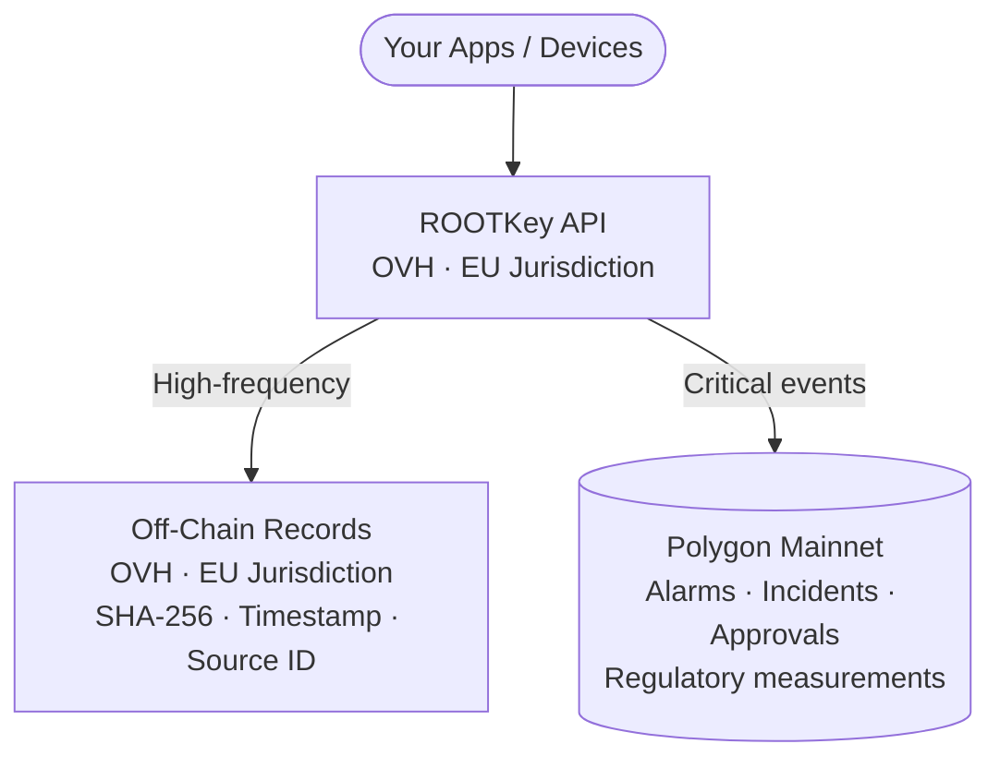

<Note>
  This is a sovereignty variant of [RKP-3 (Hybrid)](/pages/protocols/rkp-3-hybrid). The anchoring mechanics are identical - the difference is that all cloud processing and storage runs on a dedicated OVH deployment rather than Azure or AWS.
</Note>

## Sovereignty Profile

| Component | Provider | Jurisdiction | Notes |
|-----------|----------|-------------|-------|
| **Blockchain (on-chain path)** | Polygon (PoS) | Global | Distributed network - no single jurisdiction |
| **Cloud / API processing** | OVH | EU (France) | Dedicated deployment on OVH Managed Kubernetes; no US parent; no CLOUD Act exposure |
| **Off-chain storage** | OVH | EU | All off-chain data in EU jurisdiction |
| **Sovereignty level** | **Partial EU** | EU cloud + global blockchain | Cloud sovereign; blockchain global |

**When to choose this variant:** You need the throughput efficiency of the hybrid model - off-chain for bulk data, on-chain for critical events - and require that all data processing and storage occur on EU-incorporated infrastructure, while the on-chain anchoring layer (Polygon) is acceptable as a global public network.

---

## How It Differs from RKP-3 Standard

| Property | RKP-3 Standard | RKP-3 Enhanced EU |
|----------|---------------|------------------|
| Blockchain | Polygon | Polygon |
| Cloud provider | Azure / AWS | **OVH (dedicated deployment)** |
| Cloud jurisdiction | US-incorporated (EU regions) | **EU-incorporated (France)** |
| CLOUD Act exposure | Yes | **No** |
| Blockchain jurisdiction | Global | Global |
| Availability | Standard | On request |

---

## Architecture

---

## Which Records Go On-Chain vs. Off-Chain

RKP-3 Enhanced EU follows the same routing logic as RKP-3 Standard - the customer configures which event types are elevated to on-chain anchoring:

| Record type | Recommended path | Rationale |
|-------------|-----------------|-----------|
| Routine telemetry / sensor readings | Off-chain (OVH) | High volume; verification on-demand is sufficient |
| Threshold breach events | On-chain (Polygon) | Likely to face regulatory scrutiny; on-chain timestamp is stronger |
| Alarm and safety events | On-chain (Polygon) | Incident investigation requires blockchain-grade evidence |
| Audit records and compliance events | On-chain (Polygon) | Regulators verifying without accessing your systems |
| Document approvals and signatures | On-chain (Polygon) | Timestamped evidence of the approval |
| Configuration changes | Off-chain with on-chain snapshot | Routine changes off-chain; periodic state snapshot on-chain |

---

## Regulatory Frameworks Addressed

| Framework | How RKP-3 Enhanced EU helps |
|-----------|------------------------------|
| **GDPR** | All off-chain processing on OVH - no US-controlled infrastructure in data pipeline |
| **NIS2** | EU cloud for critical entity operators; on-chain for the highest-stakes events |
| **DORA** | OVH removes CLOUD Act exposure; hybrid throughput suits financial data volumes |
| **IEC 62443** | EU cloud for OT event processing; Polygon anchoring for alarm and incident records |
| **ISO 27001** | EU-resident log processing and storage with on-chain integrity for critical events |

---

## Configuration

RKP-3 Enhanced EU is a dedicated deployment of the ROOTKey platform on OVH, provisioned on request. Your API integration is unchanged - the routing logic (on-chain vs. off-chain) is configured the same way as RKP-3 Standard; only the base URL points to the dedicated deployment.

Contact our team to scope an OVH-backed deployment.

→ [Request EU cloud deployment](https://rootkey.ai/contact?utm_source=api_docs&utm_medium=rkp3_eu&utm_content=demo_cta)

---

## Beyond Enhanced EU

If you require that **the on-chain anchoring layer itself** be under EU jurisdiction - not just the cloud processing - that is [RKP-3 Sovereign EU](/pages/protocols/rkp-3-sovereign), which is on the roadmap (on-premise deployment with a private chain).
