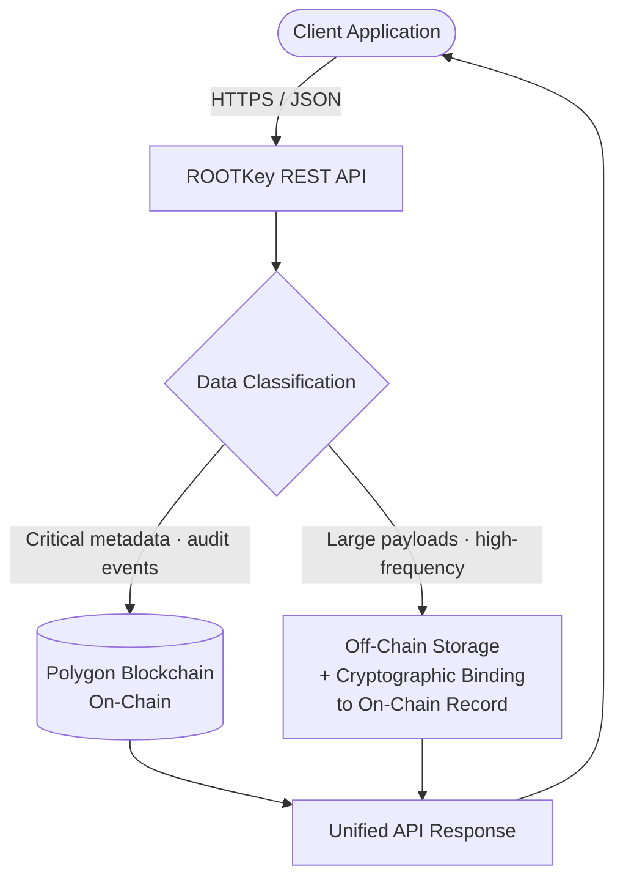

## Overview

**RKP-3 (Hybrid)** is ROOTKey's enterprise-grade data processing protocol, combining the auditability of full on-chain anchoring with the throughput of off-chain processing. It is designed for organisations that cannot afford to sacrifice either - systems requiring both high availability under load and cryptographically verifiable records for regulatory or operational purposes.

In RKP-3, critical metadata and proof-of-existence are anchored on-chain, while large payloads, high-frequency operations, or sensitive content are processed off-chain with cryptographic binding to the on-chain record. The integration model adapts to the data classification and performance requirements defined per vault or operation type.

This protocol is the default recommendation for enterprise document management, multi-party workflows, and compliance-critical platforms operating at production scale.

---

## Architecture Overview

The classification layer determines routing based on vault configuration, operation type, and payload characteristics. Both paths are cryptographically linked - the on-chain record contains a hash binding to the off-chain record, ensuring end-to-end integrity across both paths.

On-chain anchors include:

- **Operation type and timestamp**
- **Vault and asset identifiers**
- **SHA-256 hash binding** to off-chain content (where applicable)
- **Version and lineage markers**

---

## Request Limits and Throughput

| Parameter | Value |
|-----------|-------|
| Maximum requests per second | XXX |
| Maximum concurrent operations | XXX |
| Maximum payload size - on-chain path | XXX |
| Maximum payload size - off-chain path | XXX |
| Burst allowance | XXX |

For plan-specific throughput limits, visit [Pricing](/pages/pricing).

---

## Performance Indicators

| Metric | Value |
|--------|-------|
| Average latency - on-chain path | XXX ms |
| Average latency - off-chain path | XXX ms |
| P95 latency | XXX ms |
| On-chain anchoring frequency | XXX |
| Recovery time objective (RTO) | XXX |
| Recovery point objective (RPO) | XXX |

> Latency profile depends on routing - operations taking the on-chain path inherit blockchain confirmation times, while off-chain operations return near real-time. Routing is deterministic based on vault configuration.

---

## Validation Capabilities

| Validation Type | Supported |
|-----------------|-----------|
| On-chain proof of existence | Yes |
| On-chain proof of integrity (hash match) | Yes |
| Off-chain content verification | Yes (hash comparison) |
| Cross-path integrity binding | Yes |
| Independent third-party verification | Yes |
| Version history and lineage tracking | Yes |
| GDPR-compatible erasure of off-chain data | Yes |

RKP-3 supports **dual-path validation**: verifiers can confirm the on-chain anchor independently, then validate off-chain content integrity by comparing against the bound hash. This provides the same cryptographic guarantees as RKP-1 for the audit layer, with the operational flexibility of RKP-2 for the data layer.

---

## Strengths

- **Enterprise-grade flexibility** - route operations to on-chain or off-chain based on data classification, without changing the API contract
- **Full auditability for critical events** - on-chain anchoring for operations that must be independently verifiable
- **High throughput for volume operations** - off-chain path for high-frequency or large-payload workloads
- **Cryptographic binding across both paths** - integrity is guaranteed end-to-end across the full operation lifecycle
- **GDPR compatibility** - off-chain data is erasable; on-chain metadata does not contain personal data
- **Version and lineage tracking** - supports complex document lifecycle management with full history
- **Multi-party workflow support** - each party can independently verify their segment of a shared workflow

---

## Weaknesses

- **Higher architectural complexity** - requires careful vault configuration and data classification design
- **Mixed latency profile** - operations are not uniformly fast or uniformly slow; predictability depends on routing configuration
- **Storage dependency for off-chain records** - full verification of off-chain content requires retained data

---

## Typical Use Cases

<CardGroup cols={2}>
  <Card title="Enterprise Document Management" icon="folder-tree">
    Document creation, approval, versioning, and audit - with on-chain anchoring for critical events and off-chain storage for large files.
  </Card>
  <Card title="Supply Chain Traceability" icon="route">
    Multi-party custody chains with high-frequency sensor data off-chain and key transfer events anchored on-chain for regulatory evidence.
  </Card>
  <Card title="Regulated Compliance Platforms" icon="shield-check">
    Platforms serving regulated industries - insurance, legal, public sector - where different data types carry different auditability obligations.
  </Card>
  <Card title="Financial Reconciliation Systems" icon="scale-balanced">
    Transaction-level records processed off-chain at volume, with settlement and reconciliation events anchored on-chain for audit.
  </Card>
  <Card title="Clinical Trial Data Management" icon="flask">
    High-volume trial data collected off-chain with critical protocol deviations, consent events, and final submissions anchored on-chain.
  </Card>
  <Card title="Critical Infrastructure Management" icon="server">
    Operational data from critical systems where most telemetry is off-chain, but configuration changes and incident events require immutable on-chain records.
  </Card>
</CardGroup>

---

## Compliance Alignment

| Framework | Alignment |
|-----------|-----------|
| **NIS2 Directive** | Strongest alignment - supports integrity, availability, auditability, and resilience obligations across critical entity categories |
| **ISO 27001** *(in progress)* | Aligns with A.8.15 (logging), A.5.33 (protection of records), A.5.36 (compliance), A.8.12 (data leakage prevention) |
| **GDPR** | Compatible by design - off-chain erasure capability with on-chain proof-of-existence preserved |
| **DORA** | Supports digital operational resilience requirements - audit trail, incident logging, third-party risk documentation |
| **eIDAS** | On-chain anchors provide qualified electronic evidence for critical operational events |
| **IEC 62443** | Applicable for OT/IT convergence environments with mixed data classification requirements |

<Note>
ROOTKey is actively pursuing NIS2 alignment and ISO 27001 certification. Contact us at [contact@rootkey.ai](mailto:contact@rootkey.ai) for the current compliance posture, security documentation, and pending certifications.
</Note>

---

<CardGroup cols={2}>
  <Card
    title="Get started with a free account"
    icon="rocket"
    href="https://app.rootkey.ai?utm_source=api_docs&utm_medium=rkp3&utm_content=signup_cta"
  >
    Access sandbox and live environments immediately. No commitment required.
  </Card>
  <Card
    title="Request a technical briefing"
    icon="calendar"
    href="https://rootkey.ai/contact?utm_source=api_docs&utm_medium=rkp3&utm_content=briefing_cta"
  >
    Work with our engineering team to design your vault configuration and data classification strategy for RKP-3.
  </Card>
</CardGroup>
