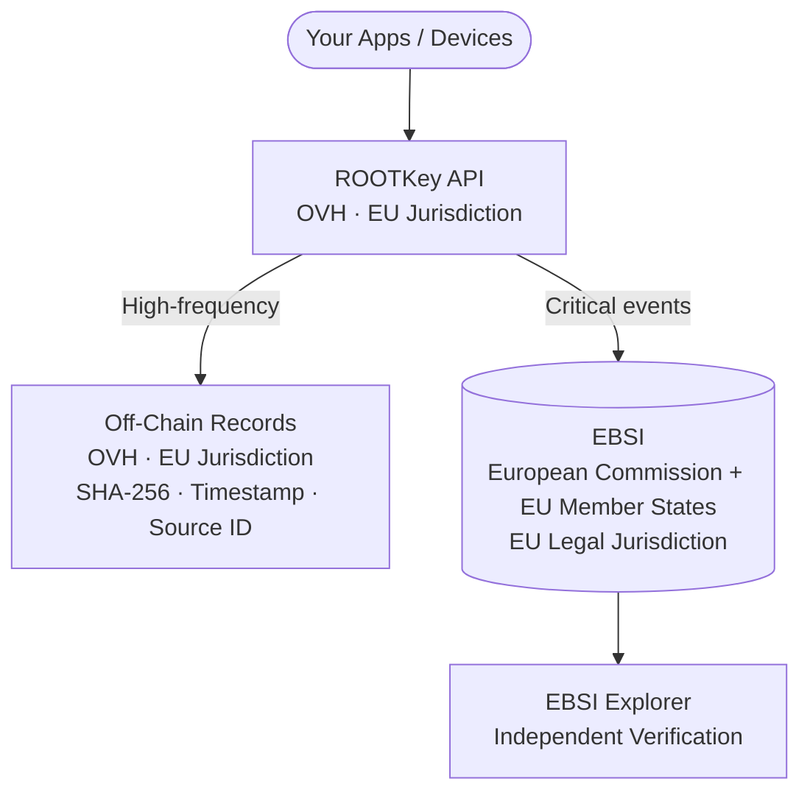

<Note>
  This is the highest-sovereignty variant of [RKP-3 (Hybrid)](/pages/protocols/rkp-3-hybrid). The anchoring mechanics are identical - the difference is that both the cloud infrastructure (OVH) and the blockchain (EBSI) are fully EU-operated and EU-governed.
</Note>

## Sovereignty Profile

| Component | Provider | Jurisdiction | Notes |
|-----------|----------|-------------|-------|
| **Blockchain (on-chain path)** | EBSI | EU | European Blockchain Services Infrastructure - operated by European Commission and EU member states |
| **Cloud / API processing** | OVH | EU (France) | No US parent; no CLOUD Act exposure; SecNumCloud certified |
| **Off-chain storage** | OVH | EU | All data remains in EU jurisdiction at rest and in transit |
| **Sovereignty level** | **Full EU** | 100% EU jurisdiction | No component subject to non-EU law |

**When to choose this variant:** You need both the throughput efficiency of the hybrid model and the guarantee that every component - cloud, storage, and blockchain - is under EU legal jurisdiction. No data, metadata, or cryptographic proof leaves the EU at any stage.

---

## The Complete Sovereignty Matrix - All Protocol Variants

| Protocol | Blockchain | Cloud | Sovereignty |
|----------|-----------|-------|------------|
| [RKP-1 Standard](/pages/protocols/rkp-1-on-chain) | Polygon | Azure / AWS | None |
| [RKP-1 Enhanced EU](/pages/protocols/rkp-1-eu) | Polygon | OVH | Partial (EU cloud) |
| [RKP-1 Sovereign EU](/pages/protocols/rkp-1-sovereign) | **EBSI** | **OVH** | **Full EU** |
| [RKP-2 Standard](/pages/protocols/rkp-2-off-chain) | - | Azure / AWS | None |
| [RKP-2 Enhanced EU](/pages/protocols/rkp-2-eu) | - | **OVH** | **Full EU (cloud)** |
| [RKP-2 Sovereign EU](/pages/protocols/rkp-2-sovereign) | EBSI (optional) | On-premise | **Full EU - air-gap** |
| [RKP-3 Standard](/pages/protocols/rkp-3-hybrid) | Polygon | Azure / AWS | None |
| [RKP-3 Enhanced EU](/pages/protocols/rkp-3-eu) | Polygon | OVH | Partial (EU cloud) |
| **RKP-3 Sovereign EU** | **EBSI** | **OVH** | **Full EU** |

---

## Architecture

---

## Which Records Go On-Chain vs. Off-Chain

The routing configuration follows the same logic as RKP-3 Standard and RKP-3 Enhanced EU. What changes is that on-chain records now land on EBSI instead of Polygon:

| Record type | Path | Anchoring target |
|-------------|------|-----------------|
| Routine telemetry / bulk sensor data | Off-chain | OVH storage |
| Regulatory measurement records | On-chain | **EBSI** |
| Alarm, safety, and incident events | On-chain | **EBSI** |
| Document approvals and signatures | On-chain | **EBSI** |
| Audit records for national authorities | On-chain | **EBSI** |
| Configuration change snapshots | On-chain (periodic) | **EBSI** |

EBSI anchoring provides:
- EU-jurisdiction timestamp and integrity proof
- Verifiability by EU regulatory authorities and member state supervisors
- Native compatibility with EU Digital Identity Wallet (EUDIW) infrastructure
- Alignment with EU government and public sector digital infrastructure standards

---

## Regulatory Frameworks Addressed

| Framework | How RKP-3 Sovereign EU helps |
|-----------|------------------------------|
| **GDPR** | 100% EU processing - no Chapter V transfer risk at any layer |
| **NIS2 - Critical Infrastructure (highest tier)** | Full EU sovereignty satisfies national requirements where even global blockchains may be restricted |
| **DORA** | Removes CLOUD Act exposure entirely; EBSI removes foreign blockchain dependency from ICT risk assessment |
| **EU Cybersecurity Act (EUCS) - High assurance** | Full EU infrastructure stack aligns with highest EUCS level for sensitive EU-operated services |
| **SecNumCloud (ANSSI)** | OVH certification for EU-sovereign cloud processing |
| **BSI C5 (Germany)** | OVH BSI C5 attestation for German federal requirements |
| **EU Digital Identity Wallet (EUDIW)** | EBSI is native to EUDIW - RKP-3 Sovereign EU is the natural choice for EUDIW-integrated services |
| **Public sector (EU)** | Satisfies EU institutional preference for European digital infrastructure in regulated procurement |
| **Defence-adjacent** | No dependency on non-EU network for any integrity proof in the pipeline |

---

## Target Organisations

<CardGroup cols={2}>
  <Card title="Critical national infrastructure" icon="tower-broadcast">
    Energy, water, transport, and digital infrastructure operators where EU sovereignty is a regulatory or national security requirement.
  </Card>
  <Card title="EU institutions and agencies" icon="landmark">
    European Commission, Parliament, Council, and EU agencies subject to institutional data sovereignty policies.
  </Card>
  <Card title="Financial entities under DORA (highest risk)" icon="building-columns">
    Systemically important financial institutions where ICT infrastructure under US jurisdiction creates unacceptable concentration risk.
  </Card>
  <Card title="EUDIW credential issuers and verifiers" icon="id-card">
    Trust service providers and public authorities participating in the EU Digital Identity Wallet ecosystem.
  </Card>
  <Card title="Healthcare and clinical research" icon="heart-pulse">
    EU hospitals, clinical research organisations, and pharmaceutical manufacturers with the strictest data residency requirements.
  </Card>
  <Card title="Classified and defence-adjacent" icon="shield-halved">
    Organisations with classification obligations or operational requirements that prohibit non-EU infrastructure in the integrity pipeline.
  </Card>
</CardGroup>

---

## Availability

RKP-3 Sovereign EU is available **on request** for organisations with demonstrated sovereignty requirements. Deployment involves:

1. Dedicated OVH tenancy for API processing and storage
2. EBSI network configuration for on-chain anchoring
3. EU-law-governed data processing and service agreement
4. Sovereignty architecture review and documentation package for regulatory evidence

→ [Request RKP-3 Sovereign EU deployment](https://rootkey.ai/contact?utm_source=api_docs&utm_medium=rkp3_sovereign&utm_content=demo_cta)
