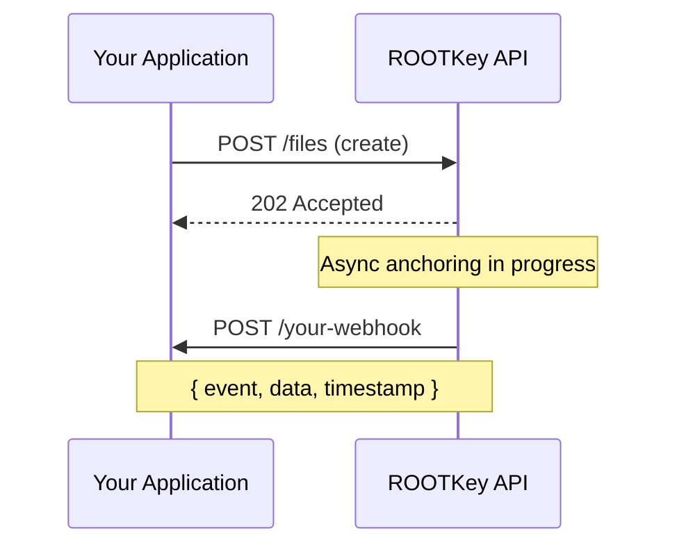

Webhooks allow your application to react to ROOTKey events without polling the API. When an asynchronous operation completes - such as a blockchain anchor being confirmed, or a validation result being produced - ROOTKey sends an HTTP `POST` request to your configured endpoint with the event payload.

Webhooks are the recommended pattern for integrations using [RKP-2](/pages/protocols/rkp-2-off-chain) and [RKP-3](/pages/protocols/rkp-3-hybrid), where blockchain anchoring is asynchronous and the API response does not include the final anchor confirmation.

---

## How It Works



1. You call the ROOTKey API - the response is immediate
2. ROOTKey processes the operation asynchronously (blockchain anchoring, validation, etc.)
3. When the operation completes, ROOTKey delivers an event to your webhook endpoint
4. Your endpoint responds with `2xx` to acknowledge receipt

---

## Configuring Webhooks

Webhook endpoints are configured from the ROOTKey platform dashboard:

<Steps>
  <Step title="Open Webhook Settings">
    Navigate to your workspace settings and select **Webhooks**.
  </Step>
  <Step title="Add an endpoint">
    Enter the HTTPS URL of your endpoint. The endpoint must be publicly reachable and respond to `POST` requests.
  </Step>
  <Step title="Select events">
    Choose which event types should trigger delivery to this endpoint. You can configure multiple endpoints with different event subscriptions.
  </Step>
  <Step title="Save and verify">
    ROOTKey sends a test event to verify the endpoint is reachable. Confirm receipt in your application.
  </Step>
</Steps>

---

## Event Types

| Event | Trigger |
|-------|---------|
| `file.anchor.confirmed` | Blockchain anchor confirmed for a file create or version operation |
| `file.validation.completed` | Validation result produced for a file |
| `file.transfer.completed` | File ownership transfer completed |
| `record.anchor.confirmed` | Blockchain anchor confirmed for a record operation |
| `vault.deactivated` | A vault was deactivated |
| `vault.reactivated` | A vault was reactivated |

---

## Event Payload

All webhook events share a common envelope structure:

```json
{
  "id": "evt_01HZ...",
  "type": "file.anchor.confirmed",
  "timestamp": "2025-09-01T14:32:00Z",
  "workspace_id": "ws_01HZ...",
  "data": {
    "file_id": "file_01HZ...",
    "vault_id": "vault_01HZ...",
    "version": 1,
    "tx_hash": "0xabc123...",
    "block_number": 12345678,
    "anchored_at": "2025-09-01T14:31:58Z"
  }
}
```

| Field | Description |
|-------|-------------|
| `id` | Unique event identifier - use for deduplication |
| `type` | The event type |
| `timestamp` | ISO 8601 timestamp of when the event was generated |
| `workspace_id` | The workspace that generated the event |
| `data` | Event-specific payload |

---

## Security - Verifying Webhook Signatures

ROOTKey signs all webhook deliveries with an HMAC-SHA256 signature. You should always verify this signature before processing an event.

The signature is included in the `X-ROOTKey-Signature` header:

```
X-ROOTKey-Signature: sha256=abc123...
```

To verify:

1. Retrieve your webhook secret from the ROOTKey dashboard
2. Compute `HMAC-SHA256(secret, raw_request_body)`
3. Compare the result to the value in `X-ROOTKey-Signature`
4. Reject events where the signature does not match

```python
import hmac
import hashlib

def verify_signature(payload_body: bytes, secret: str, signature_header: str) -> bool:
    expected = hmac.new(
        secret.encode(),
        payload_body,
        hashlib.sha256
    ).hexdigest()
    return hmac.compare_digest(f"sha256={expected}", signature_header)
```

<Warning>
  Never process a webhook event without verifying its signature. Unverified webhooks can be spoofed by any party that knows your endpoint URL.
</Warning>

---

## Delivery and Retry Policy

| Property | Value |
|----------|-------|
| Delivery method | `POST` with `Content-Type: application/json` |
| Timeout | 30 seconds |
| Success condition | Your endpoint returns a `2xx` status code |
| Retry attempts | Up to 5 retries with exponential backoff |
| Retry window | Up to 24 hours |
| Ordering guarantee | Events are delivered at least once - implement idempotency using the `id` field |

If your endpoint returns a non-`2xx` response or times out, ROOTKey retries delivery according to the schedule above. After all retries are exhausted, the event is marked as failed and visible in the webhook delivery log in the dashboard.

---

## Best Practices

**Respond quickly, process asynchronously**
Your webhook handler should acknowledge the event immediately with a `2xx` response and process the payload in a background job. Long-running handlers risk timing out and triggering retries.

**Implement idempotency**
Use the event `id` field to deduplicate - the same event may be delivered more than once during retry cycles.

**Always verify signatures**
Reject any event where the signature cannot be verified.

**Monitor delivery failures**
Check the webhook delivery log in the ROOTKey dashboard regularly. Persistent failures may indicate endpoint availability issues or signature verification problems.
