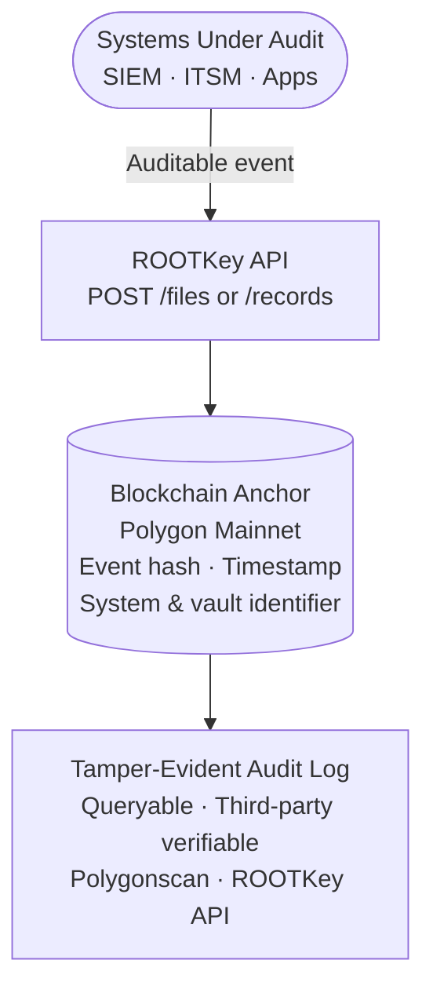

## The Problem

Regulators don't just ask whether you were compliant - they ask whether you can **prove** it. And the burden of proof is increasing.

NIS2 requires critical entities to demonstrate integrity and auditability of their information systems. DORA demands operational resilience documentation and incident audit trails from financial entities. ISO 27001 mandates logging and protection of records. In practice, most organisations produce logs - but logs are stored in systems that administrators can access, modify, or purge. When a regulator or auditor examines a log, they are trusting the organisation's assurance that the log hasn't been tampered with.

That trust assumption is the vulnerability. ROOTKey eliminates it.

---

## How ROOTKey Solves It

ROOTKey anchors each audit event - a configuration change, an access grant, a system action, an incident - to the Polygon blockchain at the moment it occurs. The anchor is:

- **Immutable** - no administrator, no breach, no system failure can alter a record after it is anchored
- **Timestamped by the blockchain** - the timestamp is set by network consensus, not by your system clock
- **Independently verifiable** - regulators, auditors, and counterparties can verify records without your cooperation

This transforms your audit trail from a log that you assure is accurate into a record that anyone can verify is accurate. The difference matters enormously when the organisation producing the log is itself under investigation.

---

## Architecture

ROOTKey integrates alongside your existing SIEM, ITSM, or logging infrastructure. You do not replace your log systems - you add a cryptographic integrity layer that makes each log entry independently verifiable.

---

## Implementation

<Steps>
  <Step title="Design your vault structure around audit domains">
    Create a vault per audit domain - one for access control events, one for configuration changes, one for incident records. This enables granular access control and simplifies providing regulators with evidence scoped to specific systems or periods.

    → [Create Vault](/api-reference/platform/endpoint/vaults/create-vault)
  </Step>

  <Step title="Anchor each auditable event at emission">
    Hook into your event pipeline - SIEM, logging agent, application middleware - and send each auditable event to ROOTKey immediately when it is generated, before it is written to any mutable storage.

    → [Create File](/api-reference/platform/endpoint/files/create-file)
  </Step>

  <Step title="Use Tables for structured, queryable audit records">
    For structured event data - JSON logs, audit records with typed fields - use the Tables API to store records with schema validation and record-level integrity anchoring. This allows querying specific event types while preserving per-record verifiability.

    → [Tables API](/api-reference/platform/endpoint/tables/overview) · [Records API](/api-reference/platform/endpoint/records/overview)
  </Step>

  <Step title="Monitor your audit workload with Analytics">
    Use the Analytics API to track anchoring volume over time. This is useful for demonstrating continuous compliance activity to auditors and detecting gaps in coverage.

    → [Analytics - Vault Creation Over Time](/api-reference/platform/endpoint/analytics/analyse-creation-of-vaults-over-time) · [Analytics - Files vs Validations](/api-reference/platform/endpoint/analytics/analyse-files-x-validations)
  </Step>

  <Step title="Provide verifiable evidence packages to regulators">
    When a regulator requests evidence, provide the vault ID, file IDs, and on-chain transaction hashes for the relevant period. The regulator can independently verify each record via Polygonscan - no access to your systems required, no trust assumption required.
  </Step>
</Steps>

---

## Recommended Configuration

| Parameter | Recommendation |
|-----------|---------------|
| **Protocol** | [RKP-1 (Full On-Chain)](/pages/protocols/rkp-1-on-chain) for maximum regulatory defensibility; [RKP-3 (Hybrid)](/pages/protocols/rkp-3-hybrid) for high-volume event streams |
| **Deployment** | [API Integration](/pages/deployment/api-integration) for cloud-native logging pipelines; [On-Premise](/pages/deployment/on-premise) for air-gapped regulated environments; [MQTT](/pages/deployment/mqtt) for OT/SCADA event streams |
| **Anchor timing** | Anchor at event emission, not at batch export - batching introduces a window where events can be altered before anchoring |
| **Retention** | On-chain anchors are permanent; configure off-chain retention according to your regulatory retention obligations |

---

## Key API Endpoints

| Endpoint | Purpose |
|----------|---------|
| [Create Vault](/api-reference/platform/endpoint/vaults/create-vault) | Create audit-domain-scoped vaults |
| [Create File](/api-reference/platform/endpoint/files/create-file) | Anchor individual audit events |
| [File History](/api-reference/platform/endpoint/files/get-files-history) | Full event history for a specific record |
| [File Validations](/api-reference/platform/endpoint/files/get-files-validations) | Retrieve validation history across the vault |
| [Tables API](/api-reference/platform/endpoint/tables/overview) | Structured, queryable audit records |
| [Analytics - Files vs Validations](/api-reference/platform/endpoint/analytics/analyse-files-x-validations) | Volume and validation activity over time |

---

## Compliance Alignment

| Framework | How this use case addresses it |
|-----------|-------------------------------|
| **NIS2 Directive** | Article 21 - integrity, auditability, and monitoring of information assets; Article 23 - incident reporting with verifiable evidence |
| **DORA** | Chapter II - ICT risk management and audit requirements; Article 17 - ICT-related incident management with tamper-evident records |
| **ISO 27001** *(in progress)* | A.8.15 (logging and monitoring), A.5.33 (protection of records), A.5.36 (compliance with policies and standards) |
| **PCI-DSS** | Requirement 10 - track and monitor all access to network resources and cardholder data |
| **SOX** | Section 302/404 - internal controls over financial reporting with auditable evidence |
| **eIDAS** | Qualified electronic timestamps for audit records submitted as legal evidence |

---

<CardGroup cols={2}>
  <Card
    title="Get started - free account"
    icon="rocket"
    href="https://app.rootkey.ai?utm_source=api_docs&utm_medium=uc_audit&utm_content=signup_cta"
  >
    Set up a sandbox vault and anchor your first audit event in minutes.
  </Card>
  <Card
    title="Request a compliance architecture review"
    icon="calendar"
    href="https://rootkey.ai/contact?utm_source=api_docs&utm_medium=uc_audit&utm_content=demo_cta"
  >
    Our team will map your regulatory obligations to a concrete ROOTKey implementation and provide compliance documentation support.
  </Card>
</CardGroup>
