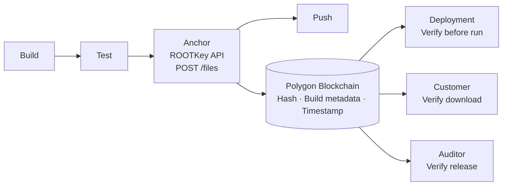

## The Problem

Software supply chain attacks are among the most impactful security incidents of the last decade. The attack surface is the gap between where code is built and where it runs - a gap that traverses artifact registries, package managers, deployment pipelines, and update mechanisms.

The core vulnerability is that software artifacts are files. Files can be altered. Most organisations have no mechanism to prove that the artifact running in production is bit-for-bit identical to the artifact that passed security review, was signed by a trusted build system, and was approved for release.

When an incident occurs - a compromised dependency, a tampered container image, a backdoored update - the investigation starts with a question that is often unanswerable: *was this artifact modified after it left the build system?*

ROOTKey makes that question answerable.

---

## How ROOTKey Solves It

ROOTKey anchors a cryptographic hash of each artifact to the Polygon blockchain at the point of creation - the moment the build system produces it. This anchor is:

- **Build-time timestamped** - the block timestamp is set by blockchain consensus, not by your CI system
- **Immutable** - no registry, no deployment system, no attacker with pipeline access can alter the anchor
- **Independently verifiable** - any deployment system, customer, or auditor can verify an artifact's integrity before executing it, without contacting the build system

If an artifact is tampered with after anchoring - in the registry, in transit, or in the update mechanism - the hash will not match the on-chain record. The tampering is detectable before deployment.

---

## Architecture

Anchoring is a single API call inserted into the CI pipeline after the build step.

---

## Implementation

<Steps>
  <Step title="Create a vault per artifact type or repository">
    Create one vault per artifact category - container images, release binaries, configuration packages, SBOM files. This organises your artifact history and allows access-controlled verification by external parties.

    → [Create Vault](/api-reference/platform/endpoint/vaults/create-vault)
  </Step>

  <Step title="Insert an anchor step into your CI pipeline">
    After the build produces an artifact, call the ROOTKey API to anchor it. This is a single API call that can be added to any CI system - GitHub Actions, GitLab CI, Jenkins, CircleCI, or any pipeline tool that can make HTTP requests.

    → [Create File](/api-reference/platform/endpoint/files/create-file) · [API Integration Guide](/pages/deployment/api-integration)
  </Step>

  <Step title="Verify before deployment">
    At the start of each deployment job, validate the artifact against its on-chain anchor. If the validation returns invalid, fail the deployment - do not proceed.

    → [Validate File](/api-reference/platform/endpoint/files/validate-file)
  </Step>

  <Step title="Anchor SBOM and signing metadata">
    Anchor your Software Bill of Materials, code signing certificate references, and dependency manifests alongside the artifact. This creates a complete, tamper-evident provenance record for every release.

    → [Create File Version](/api-reference/platform/endpoint/files/create-file-versions)
  </Step>

  <Step title="Provide verifiable release provenance to customers">
    Share the vault ID and file ID with customers or security teams. They can independently verify that the artifact they downloaded matches the one produced by your build system - without trusting your registry or your assurance.

    → [Get File](/api-reference/platform/endpoint/files/get-file-by-id) · [Get File Versions](/api-reference/platform/endpoint/files/get-file-versions)
  </Step>
</Steps>

---

## Recommended Configuration

| Parameter | Recommendation |
|-----------|---------------|
| **Protocol** | [RKP-1 (Full On-Chain)](/pages/protocols/rkp-1-on-chain) for release artifacts and SBOMs - full independent verifiability; [RKP-3 (Hybrid)](/pages/protocols/rkp-3-hybrid) for high-frequency build artifacts in rapid iteration environments |
| **Deployment** | [API Integration](/pages/deployment/api-integration) - a single API call in your CI pipeline; [Container](/pages/deployment/container) for self-hosted pipeline infrastructure |
| **Anchor scope** | Anchor the final release artifact, not intermediate build outputs - unless your threat model requires intermediate-step integrity |
| **SBOM** | Anchor SBOM alongside each artifact, linked as a version of the same file record |
| **Verification gate** | Make validation a blocking step in the deployment pipeline - a failed validation should fail the deployment, not trigger an alert |

---

## Key API Endpoints

| Endpoint | Purpose |
|----------|---------|
| [Create Vault](/api-reference/platform/endpoint/vaults/create-vault) | Create vaults per artifact type or repository |
| [Create File](/api-reference/platform/endpoint/files/create-file) | Anchor a build artifact |
| [Create File Version](/api-reference/platform/endpoint/files/create-file-versions) | Anchor a new version of an artifact |
| [Validate File](/api-reference/platform/endpoint/files/validate-file) | Verify artifact integrity pre-deployment |
| [Get File History](/api-reference/platform/endpoint/files/get-files-history) | Full artifact lineage and validation history |
| [Get File Versions](/api-reference/platform/endpoint/files/get-file-versions) | All versions of a given artifact |

---

## Compliance Alignment

| Framework | How this use case addresses it |
|-----------|-------------------------------|
| **NIS2** | Supply chain security obligations - Article 21(2)(d) - for software used in critical entity operations |
| **DORA** | Article 28 - ICT third-party risk management and software supply chain integrity for financial entities |
| **SLSA** | Blockchain-backed provenance layer complementary to SLSA build integrity requirements |
| **Executive Order 14028 (US)** | Software supply chain security - tamper-evident SBOM and artifact provenance |
| **ISO 27001** *(in progress)* | A.8.9 (configuration management), A.8.20 (network security), applied to software delivery pipelines |
| **CIS Controls** | Control 2 - inventory and control of software assets with cryptographic provenance |

---

<CardGroup cols={2}>
  <Card
    title="Get started - free account"
    icon="rocket"
    href="https://app.rootkey.ai?utm_source=api_docs&utm_medium=uc_software&utm_content=signup_cta"
  >
    Add artifact anchoring to a sandbox pipeline in minutes. No infrastructure changes required.
  </Card>
  <Card
    title="Talk to our DevSecOps team"
    icon="calendar"
    href="https://rootkey.ai/contact?utm_source=api_docs&utm_medium=uc_software&utm_content=demo_cta"
  >
    We'll design a pipeline integration and verification gate architecture tailored to your CI/CD toolchain and threat model.
  </Card>
</CardGroup>
